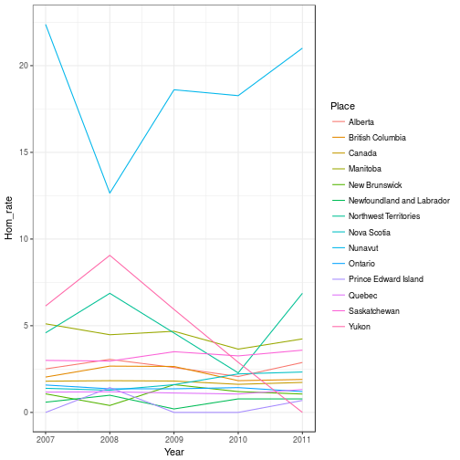
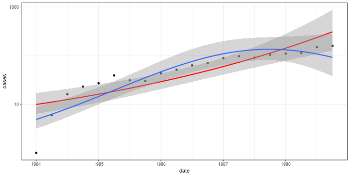
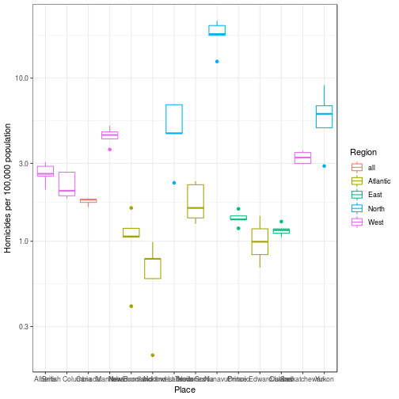
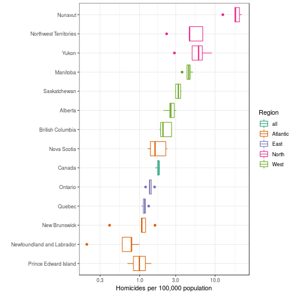
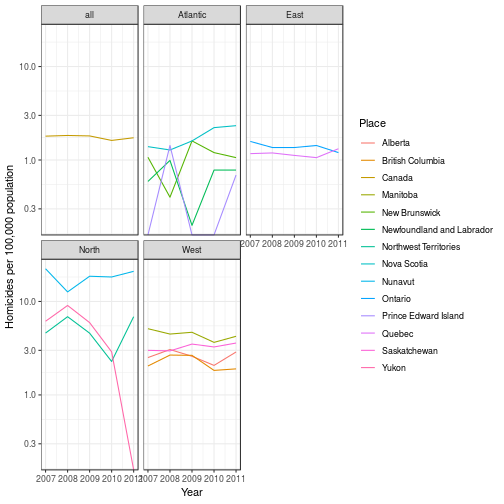
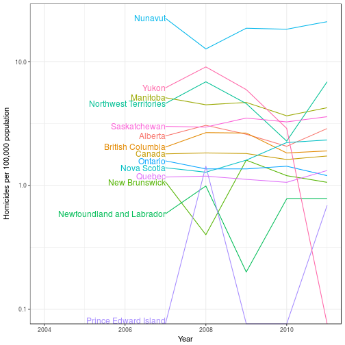

Load data from previous computations (can be downloaded from [here](data/CA_homicide.RData)):

```r
load("data/CA_homicide.RData")
```

One of the advantages of long format is that it allows us to use some of R's more powerful graphics tools such as the `ggplot2` and `lattice` packages (and it's what most statistics packages expect):


```r
library(ggplot2)
theme_set(theme_bw())  ## black-and-white theme
## set up basic plot:
p1 <- ggplot(mdat,aes(Year,Hom_rate,colour=Place))
```

Unlike base plots (which can only be saved/replayed through the RStudio interface), `ggplot` produces an R object which can then be printed (=displayed in a graphics window), or saved (or exported to a graphics file via `ggsave()`):


```r
print(p1+geom_line())
```



We could add both lines and points:

```r
print(p1+geom_line() +geom_point())
```



Might be better on a log scale, with a sensible y-axis label:

```r
p1L <- (p1
    + geom_line()
    + scale_y_log10()
    + labs(y="Homicides per 100,000 population")
)
print(p1L)
```

```
## Warning: Transformation introduced infinite values in continuous y-axis
```


Maybe we don't care about time at all:

```r
b1 <- (ggplot(mdat,aes(x=Place,y=Hom_rate,
                       colour=Region))
    + geom_boxplot(outlier.colour=NULL)  ## set outlier points to same colour as boxes
    + scale_y_log10()
    + labs(y="Homicides per 100,000 population")
)
print(b1)
```

```
## Warning: Transformation introduced infinite values in continuous y-axis
```

```
## Warning: Removed 4 rows containing non-finite values (stat_boxplot).
```



The x-axis tick labels overlap enough to be unreadable (unless we resize the
plot to be ridiculously long and narrow).

We could rotate them 90 degrees to be vertical:

```r
b1_vertlabels <- b1+theme(axis.text.x=element_text(angle=90))
print(b1_vertlabels)
```

```
## Warning: Transformation introduced infinite values in continuous y-axis
```

```
## Warning: Removed 4 rows containing non-finite values (stat_boxplot).
```


In general if you want to tweak a `ggplot` plot, Google it or
search the [ggplot theme documentation](https://ggplot2.tidyverse.org/reference/theme.html) or the [ggplot cheat sheet](https://www.rstudio.com/wp-content/uploads/2015/03/ggplot2-cheatsheet.pdf) for more information ...

Rotating the whole plot is less familiar, but arguably better.
Here I'm also (1) changing the colour palette
and (2) changing the order of the `Place` variable, using `%+%` to
substitute a different set of data into an existing plot:


```r
library(dplyr)
mdat_sort <- mdat %>% mutate(Place=reorder(Place,Hom_rate))
print(b1
      %+% mdat_sort  ## substitute sorted data
      + coord_flip()      ## rotate entire plot
      + xlab("")          ## x-label redundant
      + scale_colour_brewer(palette="Dark2") ## change palette
      )
```



Maybe we want to make our line graph less busy: 

```r
print(p1L+facet_wrap(~Region))
```



We could also code population size by line width:

```r
p2 <- (ggplot(mdat,
             aes(Year,Hom_rate,colour=Region,size=log(Pop_2011),
                 group=Place))
    + geom_line(alpha=0.5)
    + scale_y_log10()
    + labs(y="Homicides per 100,000 population")
)
print(p2)
```


Using the [directlabels](http://directlabels.r-forge.r-project.org/) package (also on [GitHub](https://github.com/tdhock/directlabels)):


```r
library(directlabels)
(p1L
    + expand_limits(x=2012)  ## add a little more space
    + geom_dl(aes(label=Place),method="last.bumpup") 
    + theme(legend.position="none")  ## don't need the legend any more
)
```



We'd have to work a little harder to avoid clipping the "Yukon" label ...
