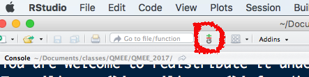

Goals
=====

-   We will discuss some principles of data management, data flow and
    reproducible research
-   Participants will continue to practice with R, and will examine
    their data and make some products

Resources
=========

-   [Managing data in R](Managing_data_in_R.html)
-   [Managing projects in R](Managing_projects_in_R.html)
-   [More bits and pieces](More_bits_and_pieces.html)

Preparation
-----------

In the second hour of Wednesday's class we will be working to get you set up with Git and Github, following [Happy Git and GitHub for the useR](http://happygitwithr.com/). 

If possible, before Monday's class:

- Register a GitHub account: you can just go straight to https://github.com to do this (by clicking on either of the green "Sign up" buttons). The one thing you may want to read first is [this advice on picking a GitHub user name](http://happygitwithr.com/github-acct.html).
- if you're on MacOS, it would be helpful to install XCode ahead of time (https://developer.apple.com/download/). If you are using an old version of MacOS, ask for help.
- it will also be helpful to install the `tidyverse` suite of R packages: 
  * within an R session, type `install.packages("tidyverse")`
  * (*or* you can do this via the package manager window in RStudio).

Exercise
========

<!---
Exercise supplemented this year because of awkward start
Old version:
Continue working on your data
-->

* E-mail your GitHub user name to `bio708qmee@gmail.com`, if you haven't already done so.
* Input your data into `R`.
* Examine your data for mistakes, and to make sure you understand the R classes
* Describe what sort of investigations you might do with your data, and how you might break it into replicable components: save this (somewhere) as a file called `README.md`
*   Make sure you know how to use `source()`, `save()` and `load()` in R: finish a task, and then close R without saving your workspace and efficiently redo the task.
* Make a directory on the github repo called `QMEE`
* add Jonathan Dushoff (`@dushoff`) and Ben Bolker (`@bbolker`) as collaborators (`Settings` > `Collaborators` (left margin) > `Add collaborator`)
add your data, a script that does something with the data, and the `README.md` file you created above to this directory
    * *most of the following steps are repo setup, which you may already have done in class*
    * (all subsequent steps are in RStudio)
	* in the menus, go to `File > New Project > Version Control > Git`
	* enter `https://github.com/<your GitHub ID>/QMEE.git` as the repository URL (or the equivalent `git@...` URL if you have set up SSH keys). You can also find this string by clicking on the `Clone` button on the front page of your repo.
	* copy your data file(s) to this directory (using the file browser in your operating system)
	* either press the `New File` button in RStudio to create your R script (when you save it, *make sure you save it in the project folder*), or copy an R script you created somewhere else to your project folder
	* find the `Git` icon in the menu bar (not the main menu bar):  
    
        * click the icon and select `Commit` from the drop-down menu
	    * check the boxes next to your new files and/or changed files
		* click `Commit` and enter a commit message
		* click the `Push` (up-arrow) icon in the upper right corner of the window
- E-mail us to say that your assignment is ready to be seen.
  - The R script should run and work independently when started in the correct directory (avoid absolute directory names in your script, and make sure you can restart your R session and run it correctly).
