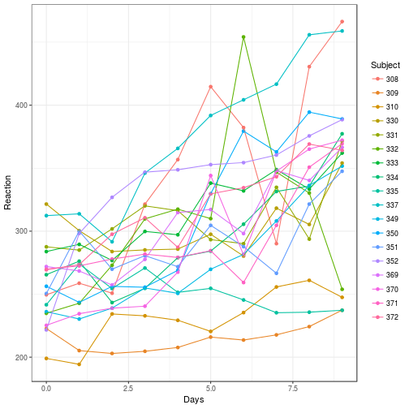

## Examples

- Most examples here taken from [Vincent Zoonekynd's page](http://zoonek2.free.fr/UNIX/48_R/14.html)
- See also [supplementary material from Bolker book chapter](http://bbolker.github.io/mixedmodels-misc/ecostats_chap.html) (source code [here](https://github.com/bbolker/mixedmodels-misc/blob/master/ecostats_chap.rmd))

## Formulae

Formula  |                  Meaning
-------------------------|------------------------------------
y ~ x                    |     No random effects
y ~ x + (1|g)            |   The intercept is a random effect

```
y ~ x + (1|site/block)      Nested random effects (block within site)
y ~ x + (1|site) + (1|year) Crossed random effects
y ~ x + (1|site:block)      Interaction (only block within site)
y ~ x + (x|g)               Intercept and slope are random effects
y ~ (x|g)                   Zero slope on average (weird!)
y ~ x + (1|g)+(0+x|g)       Independent slope and intercept
```

## Basic look at the data

- Sometimes called a *spaghetti plot*
- Alternative: use `+facet_wrap(~Subject)`


```r
library(lme4)
```

```
## Loading required package: Matrix
```

```
## 
## Attaching package: 'lme4'
```

```
## The following object is masked from 'package:stats':
## 
##     sigma
```

```r
library(ggplot2); theme_set(theme_bw())
q0 <- (ggplot(sleepstudy, aes(Days, Reaction, colour = Subject))
    + geom_point())  ## points only, use later
print(q0+geom_line())
```



## Basic model fits


```r
library(nlme)
lm1 <- lmList(Reaction~Days|Subject,data=sleepstudy) ## per-group fit (fixed)
lm2 <- lme(Reaction~Days,random=~1|Subject,data=sleepstudy) ## rand intercept
lm3 <- lme(Reaction~Days,random=~Days|Subject,data=sleepstudy) ## rand slopes
```

## Compute predictions


```r
pp <- expand.grid(Days=0:9,Subject=levels(sleepstudy$Subject))
pp1 <- cbind(pp,Reaction=predict(lm1,newdata=pp))
pp2 <- cbind(pp,Reaction=predict(lm2,newdata=pp))
pp3 <- cbind(pp,Reaction=predict(lm3,newdata=pp))
summary(lm3)
```

```
## Linear mixed-effects model fit by REML
##  Data: sleepstudy 
##        AIC      BIC    logLik
##   1755.628 1774.719 -871.8141
## 
## Random effects:
##  Formula: ~Days | Subject
##  Structure: General positive-definite, Log-Cholesky parametrization
##             StdDev    Corr  
## (Intercept) 24.740241 (Intr)
## Days         5.922103 0.066 
## Residual    25.591843       
## 
## Fixed effects: Reaction ~ Days 
##                 Value Std.Error  DF  t-value p-value
## (Intercept) 251.40510  6.824516 161 36.83853       0
## Days         10.46729  1.545783 161  6.77151       0
##  Correlation: 
##      (Intr)
## Days -0.138
## 
## Standardized Within-Group Residuals:
##         Min          Q1         Med          Q3         Max 
## -3.95355735 -0.46339976  0.02311783  0.46339621  5.17925089 
## 
## Number of Observations: 180
## Number of Groups: 18
```

## plot predictions


## the same thing with lme4::lmer


```
## Linear mixed model fit by REML ['lmerMod']
## Formula: Reaction ~ Days + (Days | Subject)
##    Data: sleepstudy
## 
## REML criterion at convergence: 1743.6
## 
## Scaled residuals: 
##     Min      1Q  Median      3Q     Max 
## -3.9536 -0.4634  0.0231  0.4634  5.1793 
## 
## Random effects:
##  Groups   Name        Variance Std.Dev. Corr
##  Subject  (Intercept) 612.09   24.740       
##           Days         35.07    5.922   0.07
##  Residual             654.94   25.592       
## Number of obs: 180, groups:  Subject, 18
## 
## Fixed effects:
##             Estimate Std. Error t value
## (Intercept)  251.405      6.825   36.84
## Days          10.467      1.546    6.77
## 
## Correlation of Fixed Effects:
##      (Intr)
## Days -0.138
```
