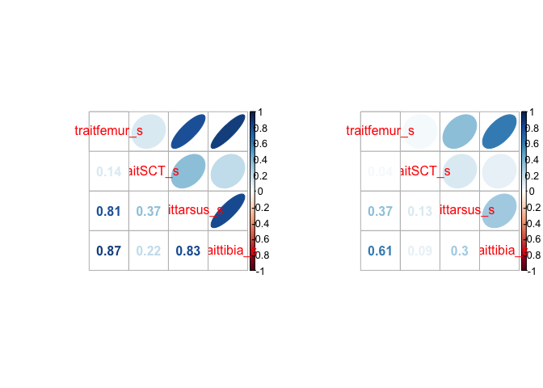
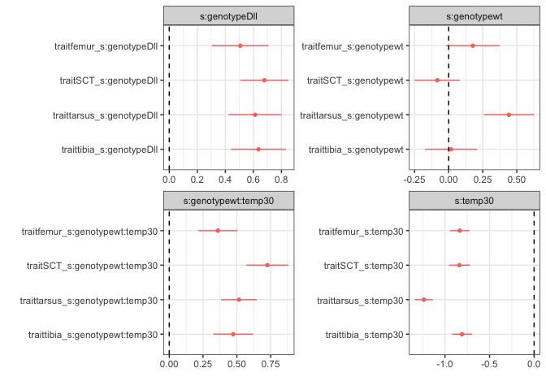
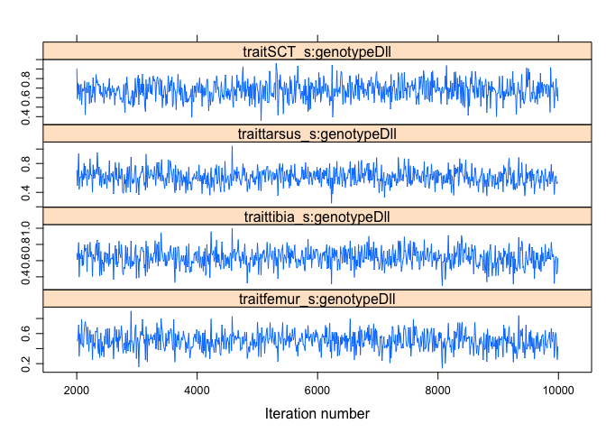
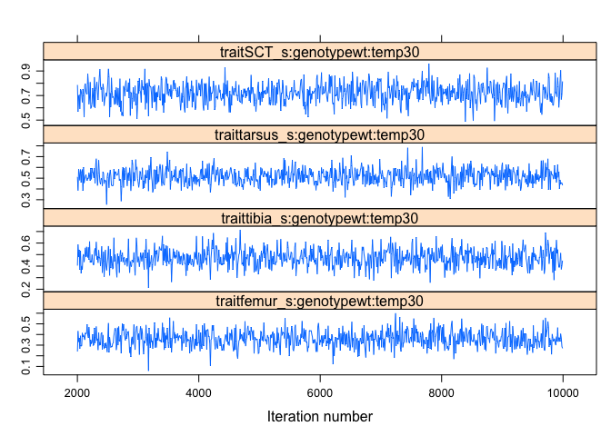
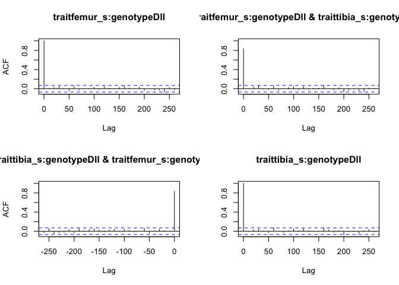
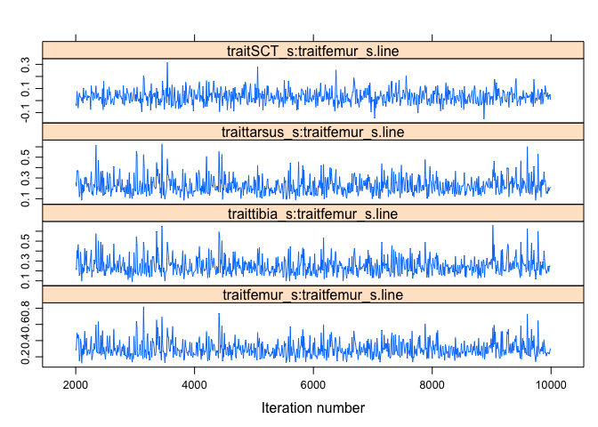
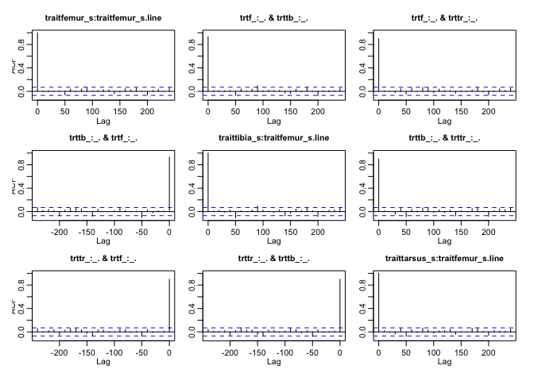
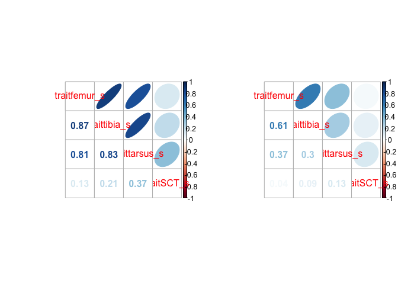
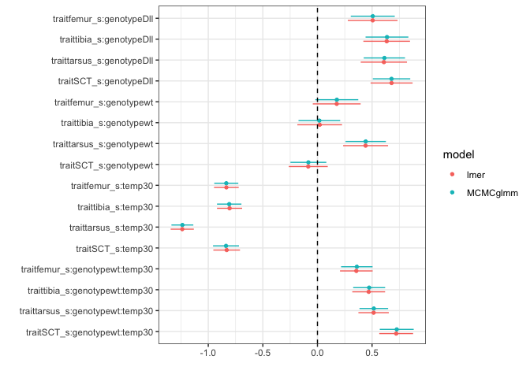

This tutorial follows from our introduction to multivariate linear models, extending it by using multivariate linear **mixed** models.

Useful packages:


```r
library(MCMCglmm)
library(lme4)
library(brms)
library(tidyr)
library(dplyr)
library(corrplot)
library(broom.mixed)
```

```
## Warning: package 'broom.mixed' was built under R version 3.5.2
```

```r
library(dotwhisker)
library(ggplot2); theme_set(theme_bw())
```

Get data:


```r
data_url <- "http://datadryad.org/bitstream/handle/10255/dryad.8377/dll.csv"
if (!file.exists("dll.csv")) {
    download.file(data_url,dest="dll.csv")
}
dll_data <- read.csv("dll.csv")
```


```r
## make temp a factor (25 vs 30 degrees)
dll_data$temp <- factor(dll_data$temp)
## scale relevant variables (fancier but less repetition than previously)
morph_vars <- c("femur","tibia","tarsus","SCT")
morph_vars_sc <- paste(morph_vars,"s",sep="_")
dll_data2 <- dll_data
## c() drops unwanted structure from the results of scale()
for (i in 1:length(morph_vars)) {
    dll_data2[[morph_vars_sc[i]]] <- c(scale(dll_data[[morph_vars[i]]]))
}
```

## Mixed models

The previous expression for the multivariate model was

$$ 
\mathbf{Y} = \mathbf{XB} + \mathbf{E}
$$

In contrast, the expression for the mixed model is

$$ 
y = \mathbf{X\beta} + \mathbf{Zb} + \epsilon
$$

where $\mathbf{b}$ is a set of Gaussian variables with a variance-covariance matrix $\mathbf{\Sigma}$ which we estimate.

Suppose we have observations of $m$ individuals, with $p$ different observations
(traits, or time points, or types of measurement, or ...) for each individual.
The way we're going to make this work is to expand ("melt", or `gather()` if we're using `tidyr`) the data set to be $mp$ observations long, then treat each individual (which was previously a single row of the data set but now comprises $p$ rows) as a group (we'll call this `units`):

## A trick to do multivariate mixed models using lme4

lme4 does not (currently) have a natural syntax for multivariate responses, however, as I eluded to in class, there is an important relationship between multivariate response models and so called "repeated" measures (or longitudinal) models. As such we can use a few tricks to estimate the model in lme4. Below this, I will go through the same model using MCMCglmm, which is a library which has a more natural syntax for such multivariate responses, but is explictly Bayesian, so you need to provide prior distributions. 


### melting code for lme4

What we need to first do (for lme4) is to generate a single column that represents the numeric values for our response traits, and then a second variable that stores the trait type.


```r
dll_melt <- (dll_data2
    %>% select(-c(femur,tibia,tarsus,SCT))  ## drop unscaled vars
    %>% mutate(units=factor(1:n()))
    %>% gather(trait,value, -c(units,replicate,line,genotype,temp))
    %>% drop_na()
)
```

And we can take a look at how this has changed the structure of the data from a "wide" format to a long format

```r
head(dll_data) # original wide
```

```
##   replicate   line genotype temp femur tibia tarsus SCT
## 1         1 line-1      Dll   25 0.590 0.499  0.219   9
## 2         1 line-1      Dll   25 0.550 0.501  0.214  13
## 3         1 line-1      Dll   25 0.588 0.488  0.211  11
## 4         1 line-1      Dll   25 0.588 0.515  0.211  NA
## 5         1 line-1      Dll   25 0.596 0.502  0.207  12
## 6         1 line-1      Dll   25 0.577 0.499  0.207  14
```


To the long format

```r
head(dll_melt)
```

```
##   replicate   line genotype temp units   trait value
## 1         1 line-1      Dll   25     1 femur_s 1.514
## 2         1 line-1      Dll   25     2 femur_s 0.138
## 3         1 line-1      Dll   25     3 femur_s 1.450
## 4         1 line-1      Dll   25     4 femur_s 1.441
## 5         1 line-1      Dll   25     5 femur_s 1.698
## 6         1 line-1      Dll   25     6 femur_s 1.044
```

## lmer fit

We can now go ahead and fit the model where we need to include trait as a predictor variable (where each trait is now a "repeated measure" from a particular subject/individual)


```r
t1 <- system.time(
    lmer1 <- lmer(value ~ trait:(genotype*temp) - 1 +
                      (trait-1|line) + (trait-1|units),
                  data=dll_melt,
                  control=lmerControl(optCtrl=list(ftol_abs=1e-8),
                                      check.nobs.vs.nlev="ignore",
                                      check.nobs.vs.nRE="ignore"))
)
```

```
## Warning in (function (npt = min(n + 2L, 2L * n), rhobeg = NA, rhoend =
## NA, : unused control arguments ignored
```

## lme4: fixed-effects formula

- it doesn't make sense to consider effects that apply equally to all traits
- so, let trait interact with all the other variables, but nothing else - use `-1`
to drop intercept
- specification is equivalent to
     - `trait:(1+genotype+temp+genotype:temp)`
	 - **or** `trait + trait:genotype + trait:temp + trait:genotype:temp`

## lme4: random-effects formula

- `(trait-1|line)` means "variance/covariances of traits among lines"
- `-1` so we consider traits, not *differences* among traits
- `(trait-1|units)` specifies "var/cov of traits among units (individuals)"
- `lmer` always includes a residual variance term. This is redundant
because we have only one data point per individual per trait:
`lmerControl(...)` tells `lmer` not complain
- As a result, our within-individual
correlation estimates will be slightly overestimated
(not so for GLMMs)

## Notes on lme4 results

- the fit is a little slow (30 seconds
on my laptop) (GLMMs would be even slower)
- `print(lmer1)`, `summary(lmer1)` useful but awkward
(16 fixed effect coefficients,
we'll look at graphical summaries instead
- `fixef()` (fixed effects), `ranef()` (line/indiv deviations from pop mean), `coef()` (line/indiv-level estimates), `VarCorr` (random effects var/cov)

## lme4: random-effects var/cov

- underlying var-cov parameters are labeled $\theta$: `getME(fit,"theta")` extracts them


```r
all(abs(getME(lmer1,"theta"))>1e-4) ## check for singularity (OK in this case)
```

```
## [1] TRUE
```

```r
VarCorr(lmer1)
```

```
##  Groups   Name          Std.Dev. Corr          
##  units    traitfemur_s  0.650                  
##           traitSCT_s    0.725    0.06          
##           traittarsus_s 0.560    0.59 0.21     
##           traittibia_s  0.666    0.92 0.12 0.48
##  line     traitfemur_s  0.489                  
##           traitSCT_s    0.392    0.14          
##           traittarsus_s 0.462    0.81 0.37     
##           traittibia_s  0.473    0.87 0.22 0.83
##  Residual               0.468
```

## lme4: correlation plot


```r
par(mfrow=c(1,2))
vv1 <- VarCorr(lmer1)
## fix unit variance-covariance by adding residual variance:
diag(vv1$units) <- diag(vv1$units)+sigma(lmer1)^2
corrplot.mixed(cov2cor(vv1$line),upper="ellipse")
corrplot.mixed(cov2cor(vv1$units),upper="ellipse")
```

<!-- -->

Correlations of traits across lines are stronger than
correlations within individuals. In both cases correlations are
all positive (i.e. first axis of variation is *size* variation?)

## lme4: coefficient plot

```r
cc1 <- tidy(lmer1,effect="fixed") %>%
  tidyr::separate(term,into=c("trait","fixeff"),extra="merge",
                  remove=FALSE)
dwplot(cc1)+facet_wrap(~fixeff,scale="free",ncol=2)+
  geom_vline(xintercept=0,lty=2)
```

<!-- -->

These results tell approximately the same story (coefficients are
consistent across traits within a fixed effect, e.g. effect of higher
temperature is to reduce scores on all traits).

## lme4: random effects

**This is slow, you may not want to evaluate it on your computer**

```r
cc2 <- tidy(lmer1,
            effect = "ran_pars",
            conf.int = TRUE, conf.method = "profile")
```

# MCMCglmm

Another option is the `MCMCglmm` package, which has a natural interface for general multivariate mixed models.  It takes a while to get used to the interface, but here is an example. Please check out [here](https://cran.r-project.org/web/packages/MCMCglmm/index.html) for more information about the package, and [here](https://cran.r-project.org/web/packages/MCMCglmm/vignettes/Overview.pdf) for an overview of how to use it.

First I find it easier (given the interface of MCMCglmm) to create a formula with the response variables and predictors. This is only for the fixed effects part of the model.

```r
fmla.MMLM1  <- cbind(femur_s, tibia_s, tarsus_s, SCT_s) ~
    trait:(genotype*temp) - 1
```

Now we need to let `MCMCglmm` know which family (i.e. distribution) the response variables are. Since all are normal (Gaussian), we can specify it the following way.


```r
fam.test <- rep("gaussian", 4 )
```

Since `MCMCglmm` is fundamentally a Bayesian approach, it needs a prior. If you provide no prior by default, it tries a "flat" prior, although this rarely works. In this case I am providing a not-quite-flat prior, but just for the random effects of line and for the residual variances (could also provide them for the fixed effects). Choosing priors for variances and covariances can sometimes be tricky, and for the moment is too much to chew on in this class, so we will use the default prior distributions (inverse-Wishart is what it is called if you really care). If you want to get deep into this, come chat with me. I also have some simple tutorials where I draw out the effects of various common priors for variances and covariances.


```r
prior.model.1 <- list( R = list(V=diag(4)/4, nu=0.004),  
                       G = list(G1=list(V=diag(4)/4, nu=0.004)))
```

Let's take a quick look at the prior 


```r
prior.model.1
```

```
## $R
## $R$V
##      [,1] [,2] [,3] [,4]
## [1,] 0.25 0.00 0.00 0.00
## [2,] 0.00 0.25 0.00 0.00
## [3,] 0.00 0.00 0.25 0.00
## [4,] 0.00 0.00 0.00 0.25
## 
## $R$nu
## [1] 0.004
## 
## 
## $G
## $G$G1
## $G$G1$V
##      [,1] [,2] [,3] [,4]
## [1,] 0.25 0.00 0.00 0.00
## [2,] 0.00 0.25 0.00 0.00
## [3,] 0.00 0.00 0.25 0.00
## [4,] 0.00 0.00 0.00 0.25
## 
## $G$G1$nu
## [1] 0.004
```

The `R` matrix prior is for the residuals. This is $\mathbf{R}_{4,4}$ as we have 4 traits in the VCV matrix. We have have non-zero variances for each trait as the mode for the prior, and 0 for covariances. However this is a weak prior, so even small amounts of data will largely overcome the pull of the prior. Another sensible approach we have used is to make the prior proportional to the overall observed VCV, as there is a large literature on the proportionality of covariance matrices for morphology. This may not be sensible for other types of multivariate response measures.


```r
##,depends.on=c("prior","mod_fm","get_data")}
t2 <- system.time(
    MMLM1.fit <- MCMCglmm(fmla.MMLM1,
                          random=~ us(trait):line, 
                          rcov=~ us(trait):units,
                          prior=  prior.model.1,
                          data= dll_data2, 
                          family = fam.test, 
                          nitt= 10000, burnin= 2000, thin=10)
)
```

```
## Warning: 'cBind' is deprecated.
##  Since R version 3.2.0, base's cbind() should work fine with S4 objects
```

## MCMCglmm specification: fixed effects

- `fmla.MMLM1` is the formula object we created above
- it looks like the `lmer` formula
- the `trait` term is a reserved word in `MCMCglmm`, letting it know we want to fit a multivariate mixed model
- `MCMCglmm` automatically melts the data for us (and assigns the name `trait` the same way we did manually above)

## MCMCglmm: random effects

- `random=~us(trait):line` asks `MCMCglmm` to fit an *unstructured* covariance matrix for the line term (i.e the different wild type genotypes we are examining).- "Unstructured" means we are estimating the complete 4 x 4 matrix of covariances (= 4*5/2 = 10 elements total)
- equivalent to `(trait-1|line)` in `lmer` model
- `MCMCglmm` also automatically adds a `units`
- `rcov=~us(trait):units` = `(trait-1|units)`
- `MCMCglmm` offers a few other options for variance-covariance structures

## MCMCglmm: other options

The `nitt` is how many iterations for the MCMC we want to perform, and the `burnin` is how many should be ignored at the beginning of the random walk.

## MCMCglmm: diagnostics

The fit takes 71 seconds.

Normally we would spend a fair bit of time on diagnostics of the MCMC, but for now we will just quickly check the trace plots and autocorrelation.

In the fitted object `$Sol` is for solution, which is the term used for fixed effects in MCMCglmm. `$VCV` is for the variance-covariance matrix.


```r
library(lattice)
xyplot(MMLM1.fit$Sol[,1:4])
```

<!-- -->

```r
xyplot(MMLM1.fit$Sol[,13:16])
```

<!-- -->

```r
acf(MMLM1.fit$Sol[,1:2])
```

<!-- -->

```r
xyplot(MMLM1.fit$VCV[,1:4])
```

<!-- -->

```r
acf(MMLM1.fit$VCV[,1:3])
```

<!-- -->

Nothing terribly worrying.


```r
summary(MMLM1.fit)
```

```
## 
##  Iterations = 2001:9991
##  Thinning interval  = 10
##  Sample size  = 800 
## 
##  DIC: 17451 
## 
##  G-structure:  ~us(trait):line
## 
##                                  post.mean l-95% CI u-95% CI eff.samp
## traitfemur_s:traitfemur_s.line      0.2976   0.1340    0.503      800
## traittibia_s:traitfemur_s.line      0.2497   0.1156    0.428      667
## traittarsus_s:traitfemur_s.line     0.2265   0.0957    0.391      800
## traitSCT_s:traitfemur_s.line        0.0321  -0.0623    0.158      800
## traitfemur_s:traittibia_s.line      0.2497   0.1156    0.428      667
## traittibia_s:traittibia_s.line      0.2755   0.1389    0.460      699
## traittarsus_s:traittibia_s.line     0.2238   0.1076    0.392      963
## traitSCT_s:traittibia_s.line        0.0498  -0.0497    0.160     1094
## traitfemur_s:traittarsus_s.line     0.2265   0.0957    0.391      800
## traittibia_s:traittarsus_s.line     0.2238   0.1076    0.392      963
## traittarsus_s:traittarsus_s.line    0.2636   0.1195    0.430      963
## traitSCT_s:traittarsus_s.line       0.0838  -0.0154    0.202     1219
## traitfemur_s:traitSCT_s.line        0.0321  -0.0623    0.158      800
## traittibia_s:traitSCT_s.line        0.0498  -0.0497    0.160     1094
## traittarsus_s:traitSCT_s.line       0.0838  -0.0154    0.202     1219
## traitSCT_s:traitSCT_s.line          0.1953   0.0901    0.334      800
## 
##  R-structure:  ~us(trait):units
## 
##                                   post.mean l-95% CI u-95% CI eff.samp
## traitfemur_s:traitfemur_s.units      0.6440  0.60360   0.6887      800
## traittibia_s:traitfemur_s.units      0.4018  0.36908   0.4410      800
## traittarsus_s:traitfemur_s.units     0.2150  0.18503   0.2442      923
## traitSCT_s:traitfemur_s.units        0.0259 -0.00181   0.0622      800
## traitfemur_s:traittibia_s.units      0.4018  0.36908   0.4410      800
## traittibia_s:traittibia_s.units      0.6661  0.62669   0.7127      800
## traittarsus_s:traittibia_s.units     0.1787  0.15282   0.2069     1058
## traitSCT_s:traittibia_s.units        0.0602  0.03028   0.0897      800
## traitfemur_s:traittarsus_s.units     0.2150  0.18503   0.2442      923
## traittibia_s:traittarsus_s.units     0.1787  0.15282   0.2069     1058
## traittarsus_s:traittarsus_s.units    0.5343  0.50321   0.5698      800
## traitSCT_s:traittarsus_s.units       0.0834  0.05268   0.1140      779
## traitfemur_s:traitSCT_s.units        0.0259 -0.00181   0.0622      800
## traittibia_s:traitSCT_s.units        0.0602  0.03028   0.0897      800
## traittarsus_s:traitSCT_s.units       0.0834  0.05268   0.1140      779
## traitSCT_s:traitSCT_s.units          0.7464  0.70031   0.7910      800
## 
##  Location effects: cbind(femur_s, tibia_s, tarsus_s, SCT_s) ~ trait:(genotype * temp) - 1 
## 
##                                 post.mean l-95% CI u-95% CI eff.samp
## traitfemur_s:genotypeDll           0.5045   0.2606   0.7174      800
## traittibia_s:genotypeDll           0.6355   0.4267   0.8471      800
## traittarsus_s:genotypeDll          0.6131   0.3908   0.8166      800
## traitSCT_s:genotypeDll             0.6764   0.5038   0.8831      800
## traitfemur_s:genotypewt            0.1757  -0.0490   0.3938      800
## traittibia_s:genotypewt            0.0163  -0.1990   0.2089      800
## traittarsus_s:genotypewt           0.4413   0.2457   0.6523      800
## traitSCT_s:genotypewt             -0.0816  -0.2426   0.1240      800
## traitfemur_s:temp30               -0.8340  -0.9446  -0.7175      800
## traittibia_s:temp30               -0.8063  -0.9395  -0.7051      967
## traittarsus_s:temp30              -1.2387  -1.3428  -1.1366      800
## traitSCT_s:temp30                 -0.8334  -0.9607  -0.7239      701
## traitfemur_s:genotypewt:temp30     0.3595   0.2216   0.5082      800
## traittibia_s:genotypewt:temp30     0.4711   0.3305   0.6338      800
## traittarsus_s:genotypewt:temp30    0.5169   0.3822   0.6424      800
## traitSCT_s:genotypewt:temp30       0.7202   0.5626   0.8670      800
##                                  pMCMC   
## traitfemur_s:genotypeDll        <0.001 **
## traittibia_s:genotypeDll        <0.001 **
## traittarsus_s:genotypeDll       <0.001 **
## traitSCT_s:genotypeDll          <0.001 **
## traitfemur_s:genotypewt           0.11   
## traittibia_s:genotypewt           0.86   
## traittarsus_s:genotypewt        <0.001 **
## traitSCT_s:genotypewt             0.39   
## traitfemur_s:temp30             <0.001 **
## traittibia_s:temp30             <0.001 **
## traittarsus_s:temp30            <0.001 **
## traitSCT_s:temp30               <0.001 **
## traitfemur_s:genotypewt:temp30  <0.001 **
## traittibia_s:genotypewt:temp30  <0.001 **
## traittarsus_s:genotypewt:temp30 <0.001 **
## traitSCT_s:genotypewt:temp30    <0.001 **
## ---
## Signif. codes:  0 '***' 0.001 '**' 0.01 '*' 0.05 '.' 0.1 ' ' 1
```

Sometimes it is easier to look at the fixed and random effects separately.


```r
summary(MMLM1.fit$Sol)
```

```
## 
## Iterations = 2001:9991
## Thinning interval = 10 
## Number of chains = 1 
## Sample size per chain = 800 
## 
## 1. Empirical mean and standard deviation for each variable,
##    plus standard error of the mean:
## 
##                                    Mean     SD Naive SE Time-series SE
## traitfemur_s:genotypeDll         0.5045 0.1162  0.00411        0.00411
## traittibia_s:genotypeDll         0.6355 0.1090  0.00385        0.00385
## traittarsus_s:genotypeDll        0.6131 0.1081  0.00382        0.00382
## traitSCT_s:genotypeDll           0.6764 0.0982  0.00347        0.00347
## traitfemur_s:genotypewt          0.1757 0.1118  0.00395        0.00395
## traittibia_s:genotypewt          0.0163 0.1044  0.00369        0.00369
## traittarsus_s:genotypewt         0.4413 0.1050  0.00371        0.00371
## traitSCT_s:genotypewt           -0.0816 0.0910  0.00322        0.00322
## traitfemur_s:temp30             -0.8340 0.0577  0.00204        0.00204
## traittibia_s:temp30             -0.8063 0.0587  0.00207        0.00189
## traittarsus_s:temp30            -1.2387 0.0542  0.00192        0.00192
## traitSCT_s:temp30               -0.8334 0.0623  0.00220        0.00235
## traitfemur_s:genotypewt:temp30   0.3595 0.0762  0.00270        0.00270
## traittibia_s:genotypewt:temp30   0.4711 0.0767  0.00271        0.00271
## traittarsus_s:genotypewt:temp30  0.5169 0.0710  0.00251        0.00251
## traitSCT_s:genotypewt:temp30     0.7202 0.0790  0.00279        0.00279
## 
## 2. Quantiles for each variable:
## 
##                                    2.5%     25%     50%     75%  97.5%
## traitfemur_s:genotypeDll         0.2666  0.4284  0.5058  0.5779  0.736
## traittibia_s:genotypeDll         0.4122  0.5710  0.6339  0.7084  0.840
## traittarsus_s:genotypeDll        0.3983  0.5409  0.6081  0.6821  0.831
## traitSCT_s:genotypeDll           0.4901  0.6107  0.6790  0.7401  0.871
## traitfemur_s:genotypewt         -0.0534  0.1009  0.1763  0.2478  0.392
## traittibia_s:genotypewt         -0.1945 -0.0514  0.0205  0.0844  0.214
## traittarsus_s:genotypewt         0.2339  0.3763  0.4408  0.5045  0.648
## traitSCT_s:genotypewt           -0.2622 -0.1417 -0.0842 -0.0218  0.109
## traitfemur_s:temp30             -0.9532 -0.8700 -0.8342 -0.7956 -0.723
## traittibia_s:temp30             -0.9270 -0.8442 -0.8049 -0.7674 -0.691
## traittarsus_s:temp30            -1.3457 -1.2745 -1.2383 -1.2025 -1.138
## traitSCT_s:temp30               -0.9560 -0.8728 -0.8315 -0.7932 -0.713
## traitfemur_s:genotypewt:temp30   0.2216  0.3087  0.3558  0.4085  0.507
## traittibia_s:genotypewt:temp30   0.3192  0.4207  0.4692  0.5205  0.632
## traittarsus_s:genotypewt:temp30  0.3883  0.4664  0.5142  0.5677  0.664
## traitSCT_s:genotypewt:temp30     0.5632  0.6677  0.7210  0.7740  0.867
```

And for the random effects.

```r
summary(MMLM1.fit$VCV)
```

```
## 
## Iterations = 2001:9991
## Thinning interval = 10 
## Number of chains = 1 
## Sample size per chain = 800 
## 
## 1. Empirical mean and standard deviation for each variable,
##    plus standard error of the mean:
## 
##                                     Mean     SD Naive SE Time-series SE
## traitfemur_s:traitfemur_s.line    0.2976 0.1008 0.003563       0.003563
## traittibia_s:traitfemur_s.line    0.2497 0.0881 0.003114       0.003410
## traittarsus_s:traitfemur_s.line   0.2265 0.0837 0.002959       0.002959
## traitSCT_s:traitfemur_s.line      0.0321 0.0562 0.001985       0.001985
## traitfemur_s:traittibia_s.line    0.2497 0.0881 0.003114       0.003410
## traittibia_s:traittibia_s.line    0.2755 0.0888 0.003141       0.003361
## traittarsus_s:traittibia_s.line   0.2238 0.0787 0.002784       0.002538
## traitSCT_s:traittibia_s.line      0.0498 0.0542 0.001917       0.001639
## traitfemur_s:traittarsus_s.line   0.2265 0.0837 0.002959       0.002959
## traittibia_s:traittarsus_s.line   0.2238 0.0787 0.002784       0.002538
## traittarsus_s:traittarsus_s.line  0.2636 0.0867 0.003065       0.002793
## traitSCT_s:traittarsus_s.line     0.0838 0.0574 0.002028       0.001643
## traitfemur_s:traitSCT_s.line      0.0321 0.0562 0.001985       0.001985
## traittibia_s:traitSCT_s.line      0.0498 0.0542 0.001917       0.001639
## traittarsus_s:traitSCT_s.line     0.0838 0.0574 0.002028       0.001643
## traitSCT_s:traitSCT_s.line        0.1953 0.0688 0.002431       0.002431
## traitfemur_s:traitfemur_s.units   0.6440 0.0217 0.000768       0.000768
## traittibia_s:traitfemur_s.units   0.4018 0.0185 0.000654       0.000654
## traittarsus_s:traitfemur_s.units  0.2150 0.0158 0.000557       0.000518
## traitSCT_s:traitfemur_s.units     0.0259 0.0162 0.000574       0.000574
## traitfemur_s:traittibia_s.units   0.4018 0.0185 0.000654       0.000654
## traittibia_s:traittibia_s.units   0.6661 0.0223 0.000788       0.000788
## traittarsus_s:traittibia_s.units  0.1787 0.0143 0.000506       0.000440
## traitSCT_s:traittibia_s.units     0.0602 0.0158 0.000560       0.000560
## traitfemur_s:traittarsus_s.units  0.2150 0.0158 0.000557       0.000518
## traittibia_s:traittarsus_s.units  0.1787 0.0143 0.000506       0.000440
## traittarsus_s:traittarsus_s.units 0.5343 0.0174 0.000617       0.000617
## traitSCT_s:traittarsus_s.units    0.0834 0.0155 0.000550       0.000557
## traitfemur_s:traitSCT_s.units     0.0259 0.0162 0.000574       0.000574
## traittibia_s:traitSCT_s.units     0.0602 0.0158 0.000560       0.000560
## traittarsus_s:traitSCT_s.units    0.0834 0.0155 0.000550       0.000557
## traitSCT_s:traitSCT_s.units       0.7464 0.0237 0.000836       0.000836
## 
## 2. Quantiles for each variable:
## 
##                                       2.5%      25%    50%    75%  97.5%
## traitfemur_s:traitfemur_s.line     0.15708  0.22561 0.2775 0.3456 0.5565
## traittibia_s:traitfemur_s.line     0.13077  0.18758 0.2334 0.2890 0.4691
## traittarsus_s:traitfemur_s.line    0.10667  0.16692 0.2116 0.2684 0.4266
## traitSCT_s:traitfemur_s.line      -0.06854 -0.00513 0.0280 0.0645 0.1557
## traitfemur_s:traittibia_s.line     0.13077  0.18758 0.2334 0.2890 0.4691
## traittibia_s:traittibia_s.line     0.15206  0.21310 0.2590 0.3184 0.4922
## traittarsus_s:traittibia_s.line    0.11370  0.17074 0.2079 0.2592 0.4017
## traitSCT_s:traittibia_s.line      -0.04434  0.01573 0.0439 0.0807 0.1639
## traitfemur_s:traittarsus_s.line    0.10667  0.16692 0.2116 0.2684 0.4266
## traittibia_s:traittarsus_s.line    0.11370  0.17074 0.2079 0.2592 0.4017
## traittarsus_s:traittarsus_s.line   0.14509  0.20342 0.2453 0.3091 0.4734
## traitSCT_s:traittarsus_s.line     -0.00926  0.04772 0.0743 0.1148 0.2268
## traitfemur_s:traitSCT_s.line      -0.06854 -0.00513 0.0280 0.0645 0.1557
## traittibia_s:traitSCT_s.line      -0.04434  0.01573 0.0439 0.0807 0.1639
## traittarsus_s:traitSCT_s.line     -0.00926  0.04772 0.0743 0.1148 0.2268
## traitSCT_s:traitSCT_s.line         0.09980  0.14752 0.1802 0.2329 0.3592
## traitfemur_s:traitfemur_s.units    0.60459  0.62910 0.6432 0.6575 0.6906
## traittibia_s:traitfemur_s.units    0.36685  0.38891 0.4012 0.4148 0.4398
## traittarsus_s:traitfemur_s.units   0.18562  0.20373 0.2151 0.2260 0.2447
## traitSCT_s:traitfemur_s.units     -0.00761  0.01493 0.0261 0.0373 0.0571
## traitfemur_s:traittibia_s.units    0.36685  0.38891 0.4012 0.4148 0.4398
## traittibia_s:traittibia_s.units    0.62386  0.65065 0.6656 0.6806 0.7114
## traittarsus_s:traittibia_s.units   0.15187  0.16920 0.1789 0.1887 0.2065
## traitSCT_s:traittibia_s.units      0.03028  0.04951 0.0597 0.0709 0.0897
## traitfemur_s:traittarsus_s.units   0.18562  0.20373 0.2151 0.2260 0.2447
## traittibia_s:traittarsus_s.units   0.15187  0.16920 0.1789 0.1887 0.2065
## traittarsus_s:traittarsus_s.units  0.50333  0.52257 0.5336 0.5456 0.5698
## traitSCT_s:traittarsus_s.units     0.05296  0.07295 0.0832 0.0935 0.1145
## traitfemur_s:traitSCT_s.units     -0.00761  0.01493 0.0261 0.0373 0.0571
## traittibia_s:traitSCT_s.units      0.03028  0.04951 0.0597 0.0709 0.0897
## traittarsus_s:traitSCT_s.units     0.05296  0.07295 0.0832 0.0935 0.1145
## traitSCT_s:traitSCT_s.units        0.70167  0.73057 0.7464 0.7622 0.7922
```

This is not the most friendly output, and it takes a while to get used to. However, we can see that we still have evidence for something interesting going, and we could extract the vectors of effects as we did above.

let's look at the VCV matrix for the random effects of line in a slightly clearer way (as a matrix)


```r
##' extract variance-covariance matrices for MCMCglmm objects
##' does not (yet) set cor, stddev, residual-var attributes
##' may be fragile: depends on group vars not having dots in them?
VarCorr.MCMCglmm <- function(object, ...) {
    s <- summary(object$VCV)$statistics[,"Mean"]
    grps <- gsub("^[^.]+\\.([[:alnum:]]+)$","\\1",names(s))
    ss <- split(s,grps)
    getVC <- function(x) {
        nms <- gsub("^([^.]+)\\.[[:alnum:]]+$","\\1",names(x))
        n <- length(nms)
        L <- round(sqrt(n))
        dimnms <- gsub("^([^:]+):.*$","\\1",nms[1:L])
        return(matrix(x,dimnames=list(dimnms,dimnms),
                      nrow=L))
    }
    r <- setNames(lapply(ss,getVC),unique(grps))
    return(r)
}
vv <- VarCorr(MMLM1.fit)
```


```r
par(mfrow=c(1,2))
corrplot.mixed(cov2cor(vv$line),upper="ellipse")
corrplot.mixed(cov2cor(vv$units),upper="ellipse")
```

<!-- -->

- among-line effects are very similar to `lme4` estimates (variables are in a different order)
- among-individual effects a

This is only a taste of what to do, and after this we could start asking questions about this genetic variance co-variance matrix. 

Compare fixed effects:


```r
tt <- tidy(MMLM1.fit)
tt2 <- tidy(lmer1)
tt_comb <- bind_rows(lmer=tt,MCMCglmm=tt2,.id="model") %>%
    filter(effect=="fixed")
dwplot(tt_comb)+geom_vline(xintercept=0,lty=2)
```

<!-- -->

## Pros and cons

- MCMCglmm: Bayesian
    - easier to get various kinds of confidence intervals
	- flexible priors
	- more flexible variance structures
	- multiple response types within a unit (e.g. Gaussian + Poisson)
- lme4: frequentist
    - faster
	- simpler interface (??)
	- more convenient outputs
- other options: `glmmTMB`, `brms` ...
