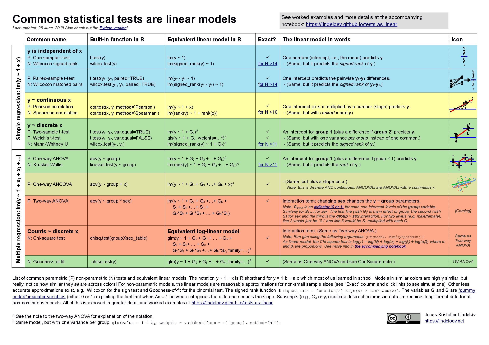
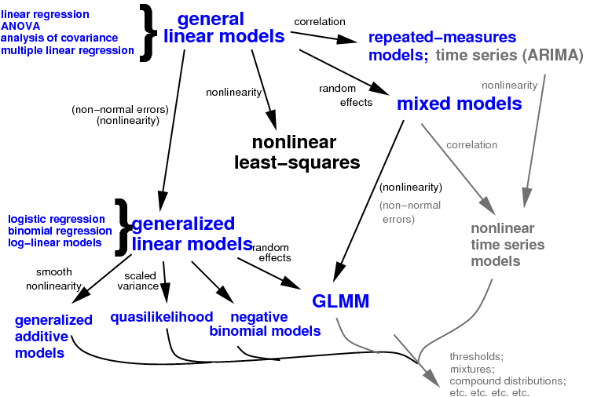

```{r setup, include=FALSE}
knitr::opts_chunk$set(dev.args = list(png = list(type = "cairo")))
```

# Introduction
 
## History
 
- $t$ test, ANOVA, regression are **all (part of) the same thing**, the **general linear model**
- "linear model" (`lm` in R), to distinguish it from the **generalized** linear model (`glm`)
- foundation of many other statistical methods


## Cheat sheet

https://lindeloev.github.io/tests-as-linear/

```{r cheat-sheet, echo = FALSE, out.width = "100%"}

```

# Basic theory

## Assumptions {.build}

> - Independence
> - **Response** (dependent) variables are linear functions of **predictor** (derived) variables, in turn based on **input** (observed, "independent") variables
     - One or more predictor variables per input variable
     - Estimate a parameter for the effect of each predictor variable
> - *Errors* or *residuals* have **constant variance** and are **Normally distributed**
     - In other words, the difference between our model *predictions*
       and our observations is Normal
         - *not* assuming the marginal distribution is Normal
> - (Predictor variables measured without error)
 
## Marginal vs conditional distributions

```{r marg-dist, echo = FALSE, message = FALSE}
library(ggplot2); set_theme(theme_bw())
library(colorspace)
r <- rep(1:3, echo = 1000)
muvec <-  c(1, 4, 10)
sdvec <-  c(1, 1, 3)
set.seed(20260207)
dd <- data.frame(r, x = rnorm(3000, mean = muvec[r], sd = sdvec[r]))
gg0 <- ggplot(dd, aes(x = x)) + geom_histogram(aes(y = after_stat(..density..)),
                                               bins = 50)
print(gg0)
```

## Marginal vs conditional distributions

```{r marg-dist-2, echo = FALSE}
print(gg0 +
        geom_density(aes(group = r, fill = factor(r),
                         y = after_stat(..density../3)),
                     color = NA, alpha = 0.4) +
        scale_fill_discrete_qualitative(guide = "none")
      )
```

## Linear or non-linear models?

> * $y = a + b x$
> * $y = a + b x + c x^2 + d x^3$
> * $y = \frac{a}{b+x}$
> * $y = a + b \log(x)$
> * $y = \log(a + b x)$
> * $y = a x^b$
> * $\log(y) = a + b \log(x)$

## Machinery
 
- *Least squares* fit - minimize the squared differences between predictions and observations
- lots of nice properties (variance partitioning etc.)
- Solution is computationally easy (linear algebra)
- Sensitive to some violations of assumptions - e.g. outliers have a strong effect
 
## One-parameter variables
 
> - Continuous predictor: straight line, one parameter 
> - $Y = a+bX$: $Y$ is the response, $X$ is the input variable   
($b$ is the *slope* - expected change in $Y$ per unit change in $X$)
> - Categorical predictor with two categories: one parameter
>    - difference in predicted value between levels, or code the categories as 0, 1 ... (*dummy variables*)
> - Parameters are (usually) easy to interpret
> - can get $p$-values, CIs for each parameter
 
## Multi-parameter variables
 
> - Often have have several
**predictor variables** (parameters) associated with each **input variable**
> - Non-linear response to an input variable
>     - Linear models can work for non-linear responses! e.g. $Y = a + bX + cX^2$ (predictor vars $\{1, X, X^2 \}$)
>     	- For complex smooth curves better to use *splines* (`splines::ns()`, or `mgcv` package)
> - Categorical variables with $>2$ levels
>     - Why can't we just code them, for example as 0, 1, 2?
>     - *dummy variables* or *contrasts*

## Effect sizes/$p$-values for multi-parameter variables

> - If you're just trying to control for it, include it in the model and then ignore it!
> - Otherwise, you can (and should) get a $p$ value for the variable as a whole (it's not in `summary()` output)
> - But we can only get CIs on the parameters --- and there are different ways to parameterize (*contrasts*)
>      - If you do have (a) clear scientific question(s), you can set up contrasts that allow you to test it/them (we can help)
>      - If you must, do pairwise comparisons, test each pair of variables for differences and make an `aabbc` list (more later)

## Interactions
 
> - Interactions allow the value of one predictor to affect the relationship between another predictor and the response variable
> - Interpreting *main effects* in the presence of interactions is tricky (*principle of marginality*)
> - Estimated effect of $A$ depends on baseline value of $B$: pick a fixed point [@schielzeth_simple_2010], or average in some way 
> - Example: $Y = a + b_1 X_1 + b_2 X_2 + b_{12} X_1 X_2$
> - The response to $X_1$ is $Y = (a+b_2 X_2) + (b_1+b_{12}X_2) X_1$  the response to $X_1$ *depends on* the value of $X_2$.
 
## Example (`nlme::Orthodont` data)

```{r int-plot, message=FALSE, warning = FALSE, echo = FALSE}
data("Orthodont", package = "nlme")
fit_lm <- lm(distance ~ Sex * age, data = Orthodont)
library(sjPlot)
library(ggplot2); set_theme(theme_bw())
plot_model(fit_lm, type = "pred", terms  = c("age [7:15]", "Sex")) +
  stat_sum(data = Orthodont, aes(x=age, y = distance, colour = Sex,
                                 fill = Sex)) +
  labs(title = "", y = "distance (mm)")
```

## An experimental example
 
> - You want to know whether (how!)  a drug treatment changes the metabolism of some rabbits
> - You're using adult, prime-aged rabbits and keeping them under controlled conditions, so you don't expect their metabolism to change *without* the drug.
>    - Not good enough!
> - You also introduce some control rabbits and treat them exactly the same, including giving them fake pills. You find no significant change in the metabolism of the control rabbits through time
>    - Still not good enough! Why?
 
## Testing interactions
 
- Use an *interaction*:
$$
M = a + B_x X + B_t t + B_{xt} Xt
$$
- The interaction term $B_{xt}$ represents the *difference in the response* between the two groups.
- It asks: **how different are the changes in the treatment group from the changes in the control group**?
 
## Interactions and parameters
 
> - In simple cases (2x2), the interaction  only uses one parameter
> - We can use CIs, and coefficient plots, and understand what's going on
> - In complicated cases, interaction terms have many parameters 
> - These have all the interpretation problems of other multi-parameter variables, or more
> - Think about "differences in differences"

## Interactions: example

> - Bear movement behaviour [@karelusEffects2017]
> - Predictor variables: sex (categorical), road type (categorical: major/minor), road length (continuous)
> - Two-way interactions
>      - sex $\times$ road length: "are females more or less sensitive to amount of road than males?"
> 	 - sex $\times$ road type: "do females vary behaviour between road type more or less than males?"
>	 - road type $\times$ road length: "how differently does amount of road affect crossings for different road types?"

## Statistical philosophy (again!)
 
> - Don't accept the null hypothesis
>     - Don't throw out predictors you wanted to test because they're not significant
> 	- Don't throw out interactions you wanted to test because they're not significant
> - This may make your life harder, but it's worth it for the karma
>     - There are techniques to deal with 'too many' predictors (e.g., ridge or lasso regression)
>    - 	good ways to estimate sensible main effects in the presence of interactions (centering variables [@schielzeth_simple_2010]; "sum-to-zero contrasts")
 
## Diagnostics
 
> - Because the linear model depends (somewhat!) on assumptions, it is good to evaluate them
> - Concerns (in order):
>     - *Bias*/*linearity*: did you miss a nonlinear relationship?
>     - *Heteroscedasticity* (does variance change across the data set, e.g. increasing variance with increasing mean?)
>     - Independence is hard to test (unless your observations are ordered, e.g. in time or space)
>     - Normality (assuming no overall problems, do your **residuals** look Normal?) [the **least important** of these assumptions]

## Diagnostic plots: base R

Data from @paczoltMultiple2015a

```{r diagplots}
skewdata <- read.csv("../data/skewdat.csv")
m1 <- lm(skew~Size, data=skewdata)
```

```{r fakeplot, eval = FALSE}
plot(m1, id.n=4)
```

## 

```{r realplot, echo = FALSE}
par(mfrow=c(2,2), mar=c(2,3,1.5,1), mgp=c(2,1,0))
plot(m1, id.n=4)
```

## performance::check_model()

```{r perf, fig.height = 10, fig.width=8, out.width="50%" }
performance::check_model(m1)
```

## DHARMa


```{r DHARMa, fig.height = 5, fig.width=10, message=FALSE, out.width = "100%"}
library(DHARMa); plot(simulateResiduals(m1))
```

## Using significance tests for diagnostics

* another mine field
* small data sets: tests not very powerful
* large data sets: tests **too** powerful
* answering the wrong question! not "are my data Normal?" (no), but "are my data sufficiently non-Normal to give me a (sufficiently) wrong answer"?
* [problems with **two-stage** approaches](https://stats.stackexchange.com/q/649761/2126) (using a test to decide what to do) [@shamsudheenShould2023]
* what should you do??

## Transformations
 
- Can deal with some problems in model assumptions by transforming variables
- A transformed scale may be as natural (or more natural) a way to think about your data as your original scale
- The linear scale (no transformation) often has direct meaning, if
you are adding things up or scaling them
- The log scale is often the best scale for thinking about physical
quantities
<!-- - The *log odds*, or *logit*, scale is often the best scale for
thinking about probabilities: 1% is to 10% as 10% is to ? -->
 
## Transformation tradeoffs
 
- A transformation may help you meet model assumptions
    - Homoscedasticity
    - Linearity
    - Normality
- No guarantee that you can fix them all at once
- Hard: Counts, data with zeros, fat tails ...
 
## Transformations to consider
 
- log $y$-lin $x$ for $y \propto e^x$; log $y$-log $x$ for $y \propto x^b$
- Box-Cox and [related transformations](https://www.rdocumentation.org/packages/car/versions/3.0-10/topics/bcPower)
- GLM may be preferable to classical transform + LM for:
     - proportions (logistic, arcsin-sqrt) [@warton_arcsine_2011; @smithsonbetter2006; @kubinecOrdered2022a]
	 - count data (log, log(1+x)) [@ohara_not_2010; @ives_for_2015; @warton_three_2016; @morrissey_revisiting_2020]
 
## Deciding whether to transform
 
- It's **not OK** to pick transformations based on trying different
ones and looking at $p$ values
- *Box-Cox transformation* tries out transformations of the form
$(y^\lambda-1)/\lambda$ ($\lambda=0$ corresponds to log-transformation) (*positive* data only)
- tricky for data $\le 0$
- see `MASS::boxcox()` or `car::powerTransform()`

## Collinearity

- ignore common advice about "variance inflation factors"
- simply throwing away correlated predictors is snoop-y and unstable
- other solutions: PCA, *a priori* choice
- @dormannCollinearity2012, @grahamConfronting2003, @morrisseyMultiple2018a, @vanhoveCollinearity2021

# Tools for fitting and inference

## Basic tools

- `lm` fits a linear model
- `summary` prints statistics associated with the fitted parameters
- `dotwhisker::dwplot()` plots a **coefficient table** [@gelman_lets_2002]; `by_2sd=TRUE` automatically scales continuous predictors
- `car::Anova()` and `drop1()` finds $p$ values for multi-parameter effects. `anova(model1, model2)` tests the difference between two specific models
- `broom::tidy()` gives you tidy coefficient tables; consider `conf.int = TRUE`
- [parameters package](https://easystats.github.io/parameters/)

## Plotting

- `plot.lm()` (*S3 method*):  diagnostic** plots
- base R:
   - `predict` to predict values (`newdata`, `se.fit` args)
   - `simulate` to simulate values from the fitted model
   - `methods(class="lm")` shows lots of possibilities
- `ggplot`: `geom_smooth(method="lm")` fits a linear model
	to each *group* of data (i.e. by facet/colour/etc.) and plots predictions with CIs
- `effects`, `emmeans`, `sjPlot`, `marginaleffects`, `ggpredict`, ...

# Examples

## Simple model 

[data](../data/lizards.csv)  [@schoenerNonsynchronous1970b]

```{r tests1, message = FALSE}
library(tidyverse)
lizards <- read.csv("../data/lizards.csv", stringsAsFactors=TRUE) |>
  mutate(across(time, ~ factor(., levels=c("early","midday","late"))))
lm_int   <- lm(grahami~light*time, data=lizards)
lm_add   <- update(lm_int, . ~ light + time)
lm_light <- update(lm_add, . ~ . - time)
lm_time  <-  update(lm_add, . ~ . - light)
```


## Summary

```{r sum_lizards}
summary(lm_add)
```

## Test effect of time (2 df) by comparing with additive model with light model (dropping time)

```{r tests1B}
anova(lm_add, lm_light)
```

## Test light

Because `light` has only two levels (sunny/shady), this gives the same $p$-value as shown in `summary()` for `lightsunny`. `drop1` and `car::Anova` give the same $p$-value too ...


```{r test_light}
anova(lm_add, lm_time)
```

## Test both light and time

```{r drop1}
drop1(lm_add, test="F")
```

## Better anova table

```{r car_anova, message = FALSE}
car::Anova(lm_add)
```

## Interaction model

```{r test2}
print(summary(lm_int))
```

## `drop1` for interaction model

Drops *only* the interaction term (respects marginality)

```{r test2B}
drop1(lm_int, test = "F")
```

## ANOVA for models with interactions

From `?car::Anova` [emphasis added]:

> Type-II tests are calculated according to the **principle of marginality**, testing each term after all others, except ignoring the term's higher-order relatives; so-called type-III tests violate marginality, testing each term in the model after all of the others.  ... **Be very careful in formulating the model for type-III tests**, or the hypotheses tested will not make sense.

Probably best to set `options(contrasts = c("contr.sum", "contr.poly"))` if you want to use type 3 ANOVA!

## compare ...

Three different questions, three different answers ...

```{r test3B, eval = FALSE}
car::Anova(lm_int, type = "II")
car::Anova(lm_int, type = "III")
## alternative to setting contrasts globally
lm_int_sum <- update(lm_int,
                     contrasts = list(light = contr.sum,
                                      time = contr.sum))
car::Anova(lm_int_sum, type = "III")
```

## Contrasts

Contrasts allow you to ask *specific* questions (rather than "is the overall term significant?" or "all pairwise contrasts")

`help("contrast-methods", package = "emmeans")`

```{r invis-load, echo = FALSE, message = FALSE}
## want to load first and ignore startup message ...
library(emmeans)
```

```{r test3}
library(emmeans)
em_time <- emmeans(lm_int, ~ time)
## default does a multiple comparisons correction
print(em_contr <- contrast(em_time, method = "eff", adjust = "none"))
```

## Plot contrasts

```{r plot-test3}
plot(em_contr) + geom_vline(xintercept = 0, lty = 2)
```

# Multiple comparisons

## Multiple comparisons

- Multiple comparisons are tricky
- can get away without them for a linear model (use variable-level $p$ values) *unless you want to do pairwise comparisons*. 
- Unlike variable-level tests, MCs depend on how you set up your model (i.e. centering of continuous variables, contrasts of categorical variables)

## compact letter displays

There is a tradition of figuring out which *pairs* of treatments are significantly different and assigning a letter to each such "not-clearly-not-equivalent" group. If you need to do this to make your supervisor happy, you can [use ggpubr](http://www.sthda.com/english/articles/24-ggpubr-publication-ready-plots/76-add-p-values-and-significance-levels-to-ggplots/). The `multcomp` package can do the basic computations too.

From Russ Lenth (`emmeans` author):

> These displays promote visually the idea that two means that are “not significantly different” are to be judged as being equal; and that is a very wrong interpretation. In addition, they draw an artificial “bright line” between P values on either side of alpha, even ones that are very close.

## Pairwise comparisons with emmeans

See [emmeans vignette on comparisons](https://cran.r-project.org/web/packages/emmeans/vignettes/comparisons.html)

```{r emmeans,message=FALSE}
library(emmeans)
library(ggplot2); theme_set(theme_bw())
e1 <- emmeans(lm_add, spec = ~ time)
```

```{r pairs-plot}
plot(pairs(e1)) + geom_vline(xintercept = 0, lty = 2)
```

## effects plot

```{r}
library(effects)
plot(allEffects(lm_int))
```

## dot-whisker plot

* depends on contrasts set in the model!
* probably works best for numeric covariates: `by_2sd` standardization available
* good for comparing models (show coefficients side-by-side, dodged)

## dot-whisker plot

```{r dw, warning = FALSE}
library(dotwhisker)
dotwhisker::dwplot(
              list(interaction = lm_int,
                   additive = lm_add)) + geom_vline(xintercept=0, lty =2)
```


## Diagnostic vs prediction vs inferential

* diagnostic plots: base-R `plot()`, `performance::check_model()`, `DHARMa`
* inferential: coefficient plots, contrast plots
* predictive: `emmeans`, `effects`, `ggpredict`

## Prediction plots

* For multi-parameter models, have to make a decision about how to set non-focal parameters
* this is what `emmeans` and `effects` packages are originally designed for

## emmeans (1)

```{r}
plot(emmeans(lm_int, ~ time*light))
```

## emmeans (2)

```{r}
plot(emmeans(lm_int, ~ time), comparison = TRUE)
```

Adds 83.4% "non-overlap" arrows [@knolmisuse2011]

```{r echo=FALSE}
oval <- 1-2*pnorm(-1.96/sqrt(2))
```

# Generalizations

## (part of) the statistical universe



## Extensions [@faraway_extending_2016]
 
- **Generalized** linear models
    - (Some) non-linear relationships
    - Non-normal response *families* (binomial, Poisson, ...)
 - **Mixed** models incorporate *random effects*
    - Categories in data represent samples from a population
    - e.g. species, sites, genes ... experimental blocks
 - Generalized **additive** models (GAMs)
    - much broader range of non-linear relationships
 

## References
