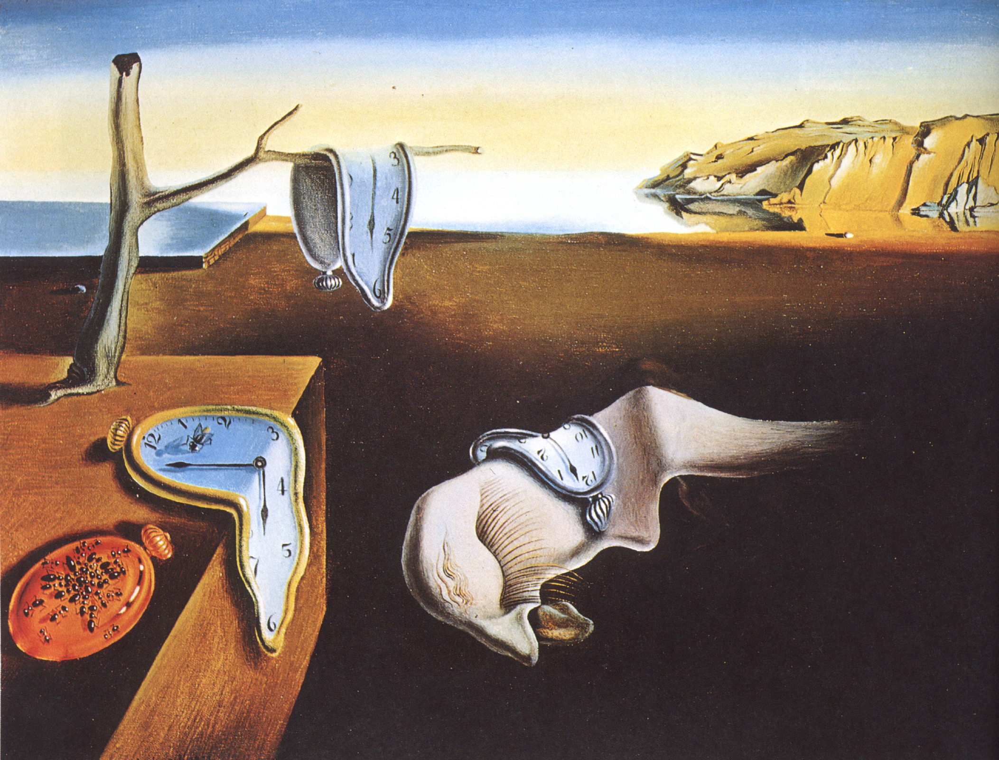

```{r setup, include = FALSE}
knitr::opts_chunk$set(echo = TRUE)
options(digits  = 3)
timefun <- function(x,units,digits=0,component="elapsed") {
    t <- x[[component]]
    if (missing(units)) {
        units <- ifelse(t>30,"minutes","seconds")
    }
    t <- switch(units,
                seconds=t,
                minutes=t/60)
    paste(format(t,digits),units)
}
```

## the big picture

Up to now, *univariate* models; have to decide which is "the" response variable.

Might measure lots of different characteristics for each individual. Could model characteristics separately, but  we don't get any information about the *overall* changes among individuals. We might want:

* a combined test of the effect of a predictor on individuals' characteristics
* information on how characteristics change in a correlated way, at the population level or within individuals

## Alternatives

* several (or many) univariate models with multiplicity correction (e.g. differential expression analysis)
* collapse variables to summary statistics (diversity metrics, principal components)

## examples

* morphometric measurements (e.g. head breadth, head length, snout-vent length)
* morphometric 'landmarks' (e.g. vein intersections on a fly wing)
* responses to different stimuli
* suites of behavioural responses
* omics: gene expression, microbial abundance, etc.

## what is a covariance matrix?

$$
\left(
\begin{array}{cccc}
\sigma^2_1 & \sigma_{12} & \sigma_{13} & \dots \\
. & \sigma^2_{2} & \sigma_{23} & \dots \\
. & . & \sigma^2_{3} & \dots \\
\vdots & \vdots & \vdots & \ddots
\end{array}
\right)
$$

* symmetric
* $\sigma^2_i$ are the variances of each variable
* $\sigma_{ij}$ are the *covariances* between $i$ and $j$
* scaling the  covariance matrix appropriately → **correlation matrix**
* the variables may be response variables (leg, arm, ...) or effects (slope, contrasts)

## 

```{r mdat, echo = FALSE}
OkIt <- palette.colors()[-1]
ctrs <- list(c(-5, -3), c(-1, 1), c(3,1))
Sigma <- matrix(c(2, 1.5, 1.5, 2), 2, 2)
ctr_dat <- rbind(unlist(ctrs[1:2]),
                 unlist(ctrs[2:3])) |>
  as.data.frame() |>
  setNames(c("x1", "y1", "x2", "y2"))
n <- 100
set.seed(101)
mdat <- do.call(rbind, lapply(ctrs, \(x) MASS::mvrnorm(n, mu = x, Sigma = Sigma)))
mdat <- data.frame(grp = factor(rep(1:3, each = n)), mdat)
```
  
```{r mplot, echo = FALSE, message = FALSE}
library(ggplot2); theme_set(theme_bw())
mplot <- ggplot(mdat, aes(X1, X2, colour = grp)) +
  geom_point() + stat_ellipse() +
  theme_minimal() +
  scale_colour_manual(values = OkIt)
print(mplot)
```

## Useful packages

```{r pkgs, message=FALSE}
library(lme4)
library(glmmTMB)
library(tidyverse); theme_set(theme_bw())
library(corrplot)
library(broom.mixed)
library(dotwhisker)
library(car)
## install.packages('gllvm',
##                  repos = c('https://jenniniku.r-universe.dev',
##                            'https://cloud.r-project.org'))
library(gllvm)
## maybe?
library(MCMCglmm)
library(brms)
```

## data

We'll use a *Drosophila melanogaster* data set from Ian Dworkin's PhD work [@dworkin_evidence_2005]. This was from a study that was meant to test predictions of a model on how mutational and environmental variation can influence the overall structure of phenotypic variation. The data include several traits (lengths) on the first leg as well as the number of sex comb teeth (a structure used to clasp females during copulation) for different wild type strains (line) reared at different developmental temperatures (temp), with and without a mutation that effects proximal-distal axis development in limbs (genotype).

## 

Get data from https://doi.org/10.5061/dryad.8376 or [this repo](https://mac-theobio.github.io/QMEE/data/dll.csv):

```{r get_data}
dll_data <- read_csv("../data/dll.csv", show_col_types = FALSE) |>
  mutate(across(c(temp, replicate, where(is.character)), factor))
morph_vars <- c("femur","tibia","tarsus","SCT")
```
##

```{r dll-data}
dll_data
```

## 

```{r dll_tab}
## tabulate and show only the first five lines
with(dll_data, table(temp, line, genotype))[,1:5,]
```

## viz 1

```{r viz1}
grp <- as.numeric(as.factor(dll_data$temp)) ## numeric line value
pairs(dll_data[morph_vars], gap = 0,
      col = grp)
```

(there's a `GGally::ggpairs()` function but it's clunky)

## viz 2

```{r spm}
form <- ~ femur + tibia + tarsus + SCT | interaction(genotype, temp)
car::scatterplotMatrix( form,
                  ellipse = TRUE, data = dll_data, gap = 0,
                  plot.points = TRUE, pch = 20, cex  = 0.5)
```

## Should you scale the response variables?

* it depends
* if responses have different units, yes
* if responses have same units (e.g. all lengths), maybe
    * do you want to weight responses with larger variance more heavily?
* log transformation is also possible
    * also makes changes unitless (proportional)
	* **but** makes different assumptions about the shape of the data

## scaling

```{r scale}
dll_data <- (dll_data |>
               ## scale & center (and convert back from matrix to vector)
               mutate(across(any_of(morph_vars), ~drop(scale(.)),
                             .names = "{.col}_s"))
)
morph_vars_s <- paste0(morph_vars, "_s")
```

## Multivariate linear model

$$
\mathbf{Y} = \mathbf{XB} + \mathbf{E}
$$

* $\mathbf{Y}$, $\mathbf{B}$, $\mathbf{E}$ are all matrices (stacking by column)
* like doing a bunch of linear regresssions in parallel (efficiently)

## fit the model

* left-hand side of the formula is a **numeric matrix**
* right-hand side is ... whatever ...

```{r mlm1}
mlm_fit1 <- lm(as.matrix(dll_data[morph_vars_s]) ~ genotype,
               data = dll_data)
print(mlm_fit1)
```

##

* `summary()` gives a list of summaries, one for each response
* `coef()` gives the coefficient *matrix*
* `broom::tidy()` works too

```{r}
coef(mlm_fit1)
head(broom::tidy(mlm_fit1))
```

## 

```{r}
car::Anova(mlm_fit1)
```

## a more complicated model

We can include multiple predictors, interactions,  etc..

```{r mlm-fit2}
mlm_fit2 <- update(mlm_fit1, . ~ genotype*temp)
car::Anova(mlm_fit2)
```

## Effect sizes?

* *Mahalanobis distance*: scale distances by *within-group covariance matrix*
* multivariate analogue of Cohen's $D$

```{r mahal-plot, echo = FALSE}
mplot + geom_segment(data = ctr_dat, aes(x = x1, y = y1, xend = x2, yend = y2), colour = "black", lwd = 2)
```

## Mixed models

The previous expression for the multivariate model was

$$ 
\mathbf{Y} = \mathbf{XB} + \mathbf{E}
$$

In contrast, the expression for the mixed model is

$$ 
y = \mathbf{X\beta} + \mathbf{Zb} + \epsilon
$$

where $\mathbf{b}$ is a set of Gaussian variables with a variance-covariance matrix $\mathbf{\Sigma}$ which we estimate.

---

* Suppose we have observations of $m$ individuals, with $p$ different observations
(traits, or time points, or types of measurement, or ...) for each individual.
* expand ("melt", or `tidyr::pivot_longer()` the data to be $mp$ observations long
* then treat each individual (previously a single row but now $p$ rows) as a group (we'll call this `units`)

## melting 

Generate a single column with the numeric values of the responses, and a second variable that stores the trait type.



```{r melt}
dll_melt <- (dll_data
    |> select(-any_of(morph_vars))
    |> mutate(units=factor(1:n()))
    |> pivot_longer(names_to = "trait", cols = morph_vars_s)
    |> drop_na()
    |> arrange(units)
)
## saveRDS(dll_melt, file="dll_melt.rds")
```

---

Look at how this has changed the structure of the data from a **wide** format:
```{r head_wide}
head(dll_data) # original wide
```

## 

to a **long** format:

```{r head_long}
head(dll_melt)
```

## lmer formula

```{r lmer-form}
lmer_form <- value ~ 0 + trait:(genotype*temp) +
  (0+trait|line) + (0+trait|units)
```

## Fixed-effect component

- it doesn't make sense to consider effects that apply equally to all traits
- so, let trait interact with all the other variables, but nothing else
- use `+0` (or `-1`) to  drop intercept
- `0 + trait:(genotype*temp)` is equivalent to  
`trait:(1+genotype+temp+genotype:temp)`
	 - **or** `trait + trait:genotype + trait:temp + trait:genotype:temp`

## Random-effect component

- `(trait+0|line)` means "variance/covariances of traits among lines"
- `+0` so we consider traits, not *differences* among traits
   - rows/cols of covariance matrix are (femur, tibia, tarsus, SCT)
- `(trait+0|units)` specifies "var/cov of traits among units (individuals)"

## lme4: control specificatons

- `lmer` always includes a residual variance term. This is redundant
because we have only one data point per individual per trait:
`lmerControl(...)` tells `lmer` not complain
- As a result, our within-individual
correlation estimates will be slightly overestimated
(not so for GLMMs)

## Now fit the model

```{r fit_lmer1,cache=TRUE}
lmer1 <- lmer(lmer_form,
              data=dll_melt,
              control=lmerControl(
                check.nobs.vs.nlev="ignore",
                check.nobs.vs.nRE="ignore"))
```

```{r allFit,eval=FALSE,echo=FALSE}
af <- allFit(lmer1, parallel="multicore",ncpus=4)
ss <- summary(af)
```


```{r cmp,echo=FALSE,results="hide"}
fvars <- function(form) {
    colnames(model.matrix(form, data=dll_melt))
}
f1 <- fvars(~trait+trait:genotype+trait:temp+trait:genotype:temp)
f2 <- fvars(~trait:(1+genotype+temp+genotype:temp)-1)
f3 <- fvars(~trait:(genotype*temp)-1)
identical(f2,f3) ## TRUE
## how to test equivalence of f1 and {f2,f3}?
```

## Notes on lme4 results

- the fit is a little slow (about 10 seconds on a fast machine: GLMMs would be even slower)
- `print(lmer1)`, `summary(lmer1)` useful but awkward
(`r length(fixef(lmer1))` fixed effect coefficients,
we'll look at graphical summaries instead
- `isSingular()` tells you if the model is singular
- `fixef()` (fixed effects), `ranef()` (line/indiv deviations from pop mean), `coef()` (line/indiv-level estimates), `VarCorr` (random effects var/cov)

## lme4: random-effects var/cov

```{r corrs}
vv1 <- VarCorr(lmer1)
print(vv1)
```

## lme4: correlation plot

```{r corrplot1,width=10}
par(mfrow=c(1,2))
## fix unit variance-covariance by adding residual variance:
diag(vv1$units) <- diag(vv1$units)+sigma(lmer1)^2
corrplot.mixed(cov2cor(vv1$line),upper="ellipse")
corrplot.mixed(cov2cor(vv1$units),upper="ellipse")
```

##

Correlations of traits across lines are stronger than
correlations within individuals. In both cases correlations are
all positive (i.e. first axis of variation is *size* variation?)

## lme4: coefficient plot

```{r dwplot, warning = FALSE}
cc1 <- tidy(lmer1,effect="fixed") |>
  tidyr::separate(term,into=c("trait","fixeff"),extra="merge",
                  remove=FALSE)
dwplot(cc1)+facet_wrap(~fixeff,scale="free",ncol=2)+
  geom_vline(xintercept=0,lty=2)
```

These results tell approximately the same story (coefficients are
consistent across traits within a fixed effect, e.g. effect of higher
temperature is to reduce scores on all traits).

## lme4: random effects confidence intervals

**This is very slow, you probably don't want to evaluate it on your computer**

```{r tidy_ran_pars, eval=FALSE}
t1_CI <- system.time(cc2 <- tidy(lmer1,
            effect = "ran_pars",
            conf.int = TRUE,
            conf.method = "profile",
            parallel="multicore",
            ncpus=8))
saveRDS(cc2, file="../data/cc2.rds")
```

(about 40 minutes to run on 8 cores on a fast machine)

## miscellaneous

* same tricks work for `glmmTMB`
* high-dimensional data (e.g. 'omics) may require other approaches
* *reduced-rank* or *factor-analytic* models (`glmmTMB` only at present)
    * `rr(0+trait|line), d)` flattens the 4-D covariance into a $d$-D space 
    * sort of like doing PCA and keeping only $d$ components
* Bayesian tools: `MCMCglmm`, `brms`
* *multi-type* models (some numeric, some count, some binary traits?): `MCMCglmm`, `gllvm`?

## what the heck are eigenvalues (eigenvectors)?

* eigenvalues: variances along the *principal axes* of the covariance matrix 
* eigenvectors: directions of the principal axes

## References

