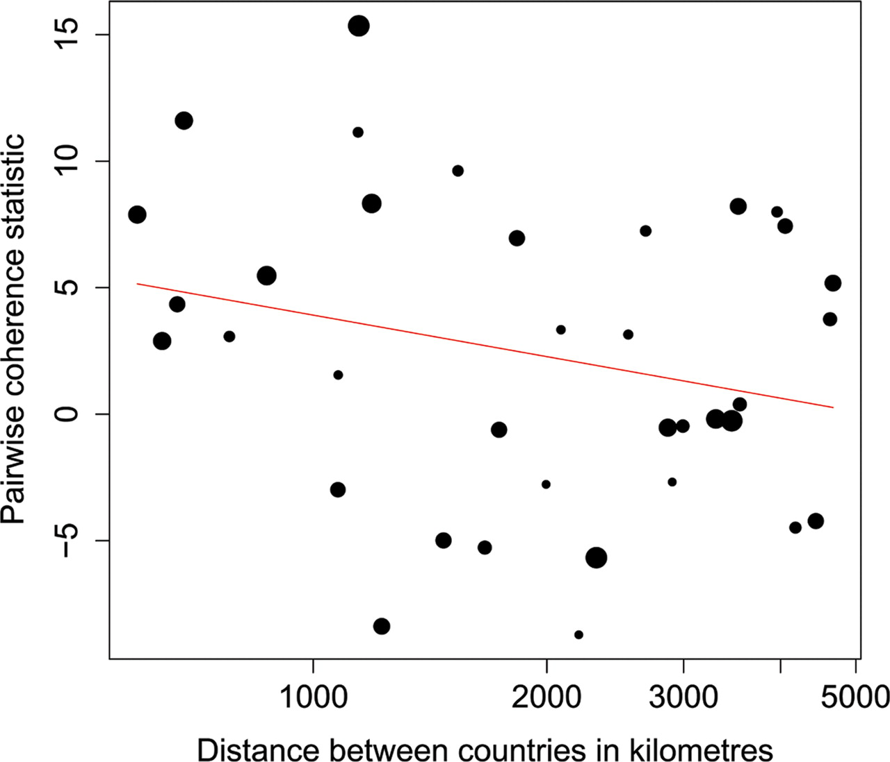

# Introduction

## Permutation approach

* The key frequentist question is:

	* could this effect be generated by chance (under the null hypothesis)

* Permutation tests provide a natural, intuitive way to test a wide range of such hypotheses:

	* If we hypothesize that two things are interchangeable, what happens if we interchange them?

## Example

[Village children simulations](https://github.com/dushoff/statistics_talks/blob/master/outputs/qmee_phil.draft.pdf)

## Overview

* Permutation tests are a rock-solid, conceptually simple way to get P values 

* They allow flexibility in constructing statistics of interest

* They provide a straightforward way of dealing with certain types of structure

	* Especially space, but also some aspects of time series

## But

* We don't want to focus on P values!

* It is often possible to associate confidence intervals with permutation tests, but:

	* Additional assumptions are (almost) always needed

	* Flexibility is dramatically reduced

	* This is not always well supported

## Hybrid approach

* Use a permutation P value as a sanity check on your more-powerful, assumption-based approach

* If P values look pretty similar (especially if they're not too small), your main approach may be fine

* I've never seen somebody use a statistical journal to track criteria for this – you could be a trend-setter

	* and we can help if you want

# Theory

## Permutation testing

* Choose a statistic that reflects the effect you are trying to measure

	* e.g., mean, median, geometric mean

* Compare the observed value of the statistic with a null distribution, generated by interchanging things that should be interchangeable under your null hypothesis

## How to compare

* Enumerate all of the possibilities (if possible)

* Simulate at least 1999 possibilities (also, if possible, you can do less if it's really necessary)

	* include the observation as if it were one of the simulations

* Use a classical analytical approximation (from a package)

	* or, I'm just putting this out there, don't do that

## Ties and tails

* "Ties" (permutations with a statistic equal to the observed statistic)  "count" against significance

	* Ties are evidence against our observation being unusual

* _Opinion:_ The best way to do a two-tailed test is to calculate a one-tailed P value for the observed effect, and then double the P value

	* Classic tests assume everything is symmetric, so people often don't need to think about this point.  _And when they do, they often get it wrong._

## How should we interpret our result?

* We have assumed nothing about distributions of ant nests

* What is the best way to interpret a significant permutation result?

* If the difference in growth had been significant we would conclude that that difference is due to _something_ real about the systems (i.e., not due to chance).

	* If we want to conclude that _mean_ growth is greater in the treatment group, we already need to assume something about distributions!

		* Maybe just that they are similar in some way across the groups

## Which statistic should we use?

* We can use any statistic we want, and get a valid test

	* Means tend to have more power than medians

	* Transformations that make the data more normal also tend to increase power

	* 	Using the geometric mean is equivalent to what transformation?

* We are not allowed to try different statistics until one works.  Why not?

## Test what you want

* You can test anything, if you can:

	* Measure it with a statistic

	* Come up with a permutation approach that reflects a scientific
	question

## Pond nutrients

* We measure correlations between a species of algae and nitrogen and phosphorous levels in natural ponds.  Thus, we have a data frame showing N, P and A (for algae).

* What kinds of tests could we do to see whether the algae are correlated with nutrient levels?

## Time and space

* [Rabies examples](http://www.pnas.org/content/104/18/7717.full)

## Animal behavior

* Observe behavior of different individual animals.  Evaluate observed statistics of (for example) tendency of bachelors to wander off from groups

	* Classic tests don't account for individual propensities

	* Switch whole "timelines" from one individual to another

# Confidence intervals

## Shifting

* If your model is “linear enough” you can get confidence intervals by essentially shifting your null distribution to be centered around the observed mean!

	* Pers comm., Dushoff

	* but you can also test it in your case with simulations

## Cases where CIs are available

* One-sample test (assuming symmetry)

* Two-sample test (assuming a shift relationship)

* Regression slopes (assuming a linear relationship)

* As with traditional models, it's good to consider transformations before you test.

# Practice

## Mantel test

* WWBBD? `ape::mantel.test`

## Packages

* coin, lmPerm, gtools

* [Examples](permutation_examples.notes.html)

# Summary

## Advantages:

* General applicability

* Conceptual clarity

* Flexibility

* Fewer assumptions

## Disadvantages

* Hard to implement

* May take a lot of computer time

* Often hard to obtain confidence intervals

