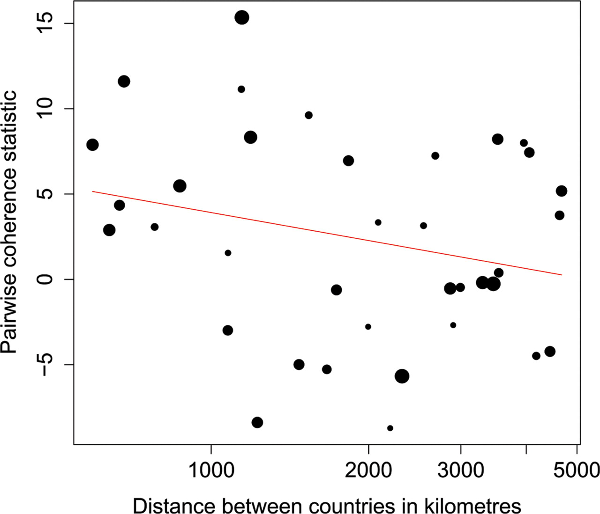

# Introduction

## Permutation approach

* The key frequentist question is:

	* could this effect be generated by chance (under the null hypothesis)

* Permutation tests provide a natural, intuitive way to test a wide range of such hypotheses:

	* If we hypothesize that two things are interchangeable, what happens if we interchange them?

# Examples

## Counting ant colonies

* We do an exhaustive survey of ant colonies in a forest habitat and an old-field habitat.  This is how many colonies we find in each survey plot:

	* Forest: 9, 6, 4, 6, 7, 10

	* Field: 12, 9, 12, 10

* Field seems to have more ant colonies

* Could this result be due to chance?

## Permutation testing

* Choose a statistic that reflects the effect you are trying to measure

	* e.g., mean, median, geometric mean

* Compared the observed value of the statistic with a null distribution, generated by interchanging things that should be interchangeable under your null hypothesis

## Field and forest ants

* Total of 210 possible permutations

* 5 have <code>Field mean - Forest mean</code> $\ge 3.75$

* What is our P value?

## Ties and tails

* "Ties" (permutations with a statistic equal to the observed statistic)  "count" against significance

	* Ties are evidence against our observation being unusual

* _Opinion:_ The best way to do a two-tailed test is to calculate a one-tailed P value for the observed effect, and then double the P value

	* Classic tests assume everything is symmetric, so people often don't need to think about this point.  _And when they do, they often get it wrong._

## How should we interpret our result?

* We have assumed nothing about the distribution of ant nests

* What is the best way to interpret our significant permutation result?

* The difference in means we observe (<code>Field mean</code> > <code>Forest mean</code>) is due to _something_ real about the systems (ie., not due to chance).

	* If we want to conclude that the field mean is "greater", we need to assume something about distributions

	* We only used one forest habitat and one old-field habitat.  What does this mean about our conclusions?

## Which statistic should we use?

* We can use any statistic we want, and get a valid test

	* Means tend to have more power than medians

	* Transformations that make the data more normal also tend to increase power

	* 	Using the geometric mean is equivalent to what transformation?

* We are not allowed to try different statistics until one works.  Why not?

# The power of permutations

## Test what you want

* You can test anything, if you can:

	* Measure it with a statistic

	* Come up with a permutation approach that reflects a scientific question

## Ant colony distributions

* Within each habitat, we can ask whether there is evidence that ant nests are aggregated, or distributed regularly?

	* In other words, do they cluster, or avoid each other?  Or can't we tell?

* A permutation approach would test this by assigning nests randomly to plots to generate a null distribution

## Pond nutrients

* We measure correlations between a species of algae and nitrogen and phosphorous levels in natural ponds.  Thus, we have a data frame showing N, P and A (for algae).

* What kinds of tests could we do to see whether the algae are correlated with nutrient levels?

# Methodology 

## Monte Carlo 

* In the distribution example, we would like to test each possible random assignment of nests to plots

* This is impossible (there are too many permutations)

* We therefore do a few thousand samples at random

	* We can treat this as a valid frequentist test

	* Or we can use classic methods to evaluate our results and see how confident we are about our P value

## Correlations

* With permutation tests, we can use any kind of prediction model, any statistic of prediction and any null hypothesis

	* Interchange things that should be interchangeable under null hypothesis

	* How likely is it that we would observe a prediction as good or better as the one we have, under the null hypothesis that $x$ is interchangeable?

## Time and space

* [Mantel tests](https://en.wikipedia.org/wiki/Mantel_test) are permutation tests

	* So is [Fisher's exact test](https://en.wikipedia.org/wiki/Fisher%27s_exact_test) (this has a weird approach to P values, and JD doesn't like it)

* [Rabies examples](http://www.pnas.org/content/104/18/7717.full)

# More applications

## Detailed models of evolution

* Infer a tree and then ask what happens if we relabel nucleotides at each site, or move mutations around the tree

* Ask if there are differences between nucleotide preference in flu evolution by "relabeling" nucleotides

## Animal behavior

* Observe behavior of different individual animals.  Evaluate observed statistics of (for example) tendency of bachelors to wander off from groups

	* Classic tests don't account for individual propensities

	* Switch whole "timelines" from one individual to another

# Confidence intervals

## Assumptions

* The strength of permutation tests is also a weakness

* Without assumptions about distributions, it's not possible to get confidence intervals

* The field of getting confidence intervals from permutation tests is still developing

	* Much can be done ...  but not without assumptions

## Medians

* Permutation tests are well suited to comparing medians (and other quantiles), because these can be evaluated without distributional assumptions

	* This approach is related to rank tests

## Means

* We can obtain confidence intervals for a single mean if we assume that the data are drawn from a symmetric distribution

	* It may be good to transform first

* We can obtain confidence intervals for the difference between two means if we assume that the distributions are identical except for a 'shift'

	* It may be good to transform first

## Correlations

* We can obtain confidence intervals for regression coefficients if we assume that the true relationship between the variables is linear

	* It may be good to transform first

# Summary

## Advantages:

* General applicability

* Conceptual clarity

* Flexibility

* Fewer assumptions

## Disadvantages

* Hard to implement

* May take a lot of computer time

* May be hard to obtain confidence intervals

