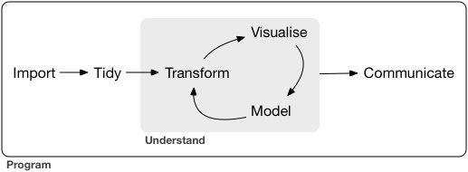
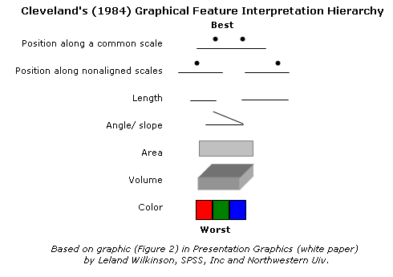
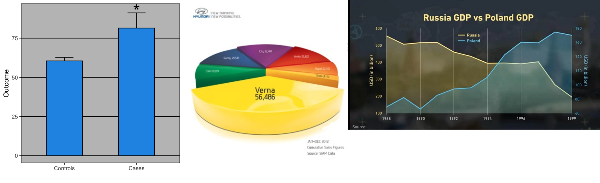

## Goals/contexts of data visualization

* Exploration

* Inference

* Explanation

# Exploration

## Approaches

Goal: find patterns (& problems) in data, explore hypotheses

* *nonparametric*/*robust* approaches: impose as few assumptions as possible
     * histograms for distributions
     * boxplots (median/IQR) instead of mean/std dev for grouped data
     * loess/GAM instead of linear/polynomial regression for continous data
* need for *speed*: quick and dirty
* canned routines for standard tasks, flexibility for non-standard tasks
* manipulate to visualize: summarize on the fly

## Visualization cycle

 [HW on Twitter](https://twitter.com/hadleywickham/status/784780387180425217)

* Avoiding **snooping**:
	* Separate response variables from predictors
	* Look at residuals but not fits

## diagnostic plots

* determine fitting problems, evaluate model assumptions
   * badness of fit, heteroscedasticity, non-Normality, outliers
	* e.g. scale-location plot, Q-Q plot; `plot.lm`
* plot methods: generic (e.g. residuals vs fitted) vs specific (e.g. residuals vs predictors)
* predictions (intuitive) vs residuals (amplifies/zooms in on discrepancies)
	* looking for **absence** of patterns in residuals
* `performance::check_model()`, `DHARMa` packages

# Inference

## What is your model telling you?

* A picture is worth 1000 words
- coefficient plots: replacement for tables [@gelman_lets_2002]; `dotwhisker::dwplot`
- also: tests of inference [@wickham_graphical_2010]

# Explanation

## Questions

* should analyses match graphs?
    * "Let the data speak for themselves" vs "Tell a story"
* display data (e.g. boxplots, standard deviations) or inferences from data (confidence intervals)
* superimposing model fits (`geom_smooth`)

## Goals

- tell an accurate story
- high information density
- Tufte, Cleveland

## Cleveland hierarchy

- [Cleveland hierarchy](https://priceonomics.com/how-william-cleveland-turned-data-visualization/): position, length, angle, area, volume, colour: also see @rauser_how_2016


## Aesthetics

- [Edward Tufte](http://en.wikipedia.org/wiki/Edward_tufte): chartjunk, data- and non-data-ink, small multiples, direct labeling, ...
- controversial stuff: [dynamite plots](http://emdbolker.wikidot.com/blog:dynamite), [pie charts](https://scc.ms.unimelb.edu.au/resources/data-visualisation-and-exploration/no_pie-charts), [dual-axes plots](http://www.perceptualedge.com/articles/visual_business_intelligence/dual-scaled_axes.pdf) ... ([source1](https://chandoo.org/wp/why-3d-pie-charts-are-evil/), [source2](https://simplystatistics.org/posts/2019-02-21-dynamite-plots-must-die/))

```{r badstuff,echo=FALSE, out.width = "100%"}

```

## other ideas

-   Extending the pipeline: R vs [GLE](http://glx.sourceforge.net/) vs. [D3.js](https://d3js.org/) vs. [plot.ly](https://plot.ly/) vs. ...
-   Showing the data vs. representing the statistical model accurately
-   Dynamic graphics (animations, pop-ups/hovertext/responsive elements, etc.)

# R approaches

## Base graphics

-   advantages: speed, simplicity, breadth
-   disadvantages: lack of structure, canvas (draw-and-forget) metaphor
-   basic commands:
    -   `plot()`, `lines()` and `points()` 
    -   `legend()`, `axis()` (for decoration)
    -   other kinds of graphs: `matplot()` for multi-series plots, `boxplot()` for box plots, `hist()` for histograms, `contour()` and `image()`, `pairs()`, ...
    -   `par(mfrow)`, `layout()` for multiple plots on a page
    -   useful packages: `car` (for `scatterplot()`, `scatterplotMatrix()`), `plotrix` (miscellaneous "plot tricks"), [`tinyplot`](https://grantmcdermott.com/tinyplot/vignettes/introduction.html) (lightweight flexible base plots)

<!--
## Lattice graphics

- alternative, higher-level graphing interface
- `xyplot` (with `type=` one or more of `"p"`, `"l"`, `"r"`,`"smooth"`, `"a"` ...), `bwplot`
-   Disadvantages: tricky to customize
-   Advantages: abstraction (relative to base graphics), speed (relative to `ggplot`), banking (aspect ratio control), shingles, faceting, 3D plots

-->

## [ggplot(2)](https://ggplot2.tidyverse.org/)

-   **data**
-   **mappings**: between variables in the data frame and **aesthetics**, or graphical attributes
(x position, y position, size, colour ...)
-   first two show up as (e.g.)  
`ggplot(my_data,aes(x=age,y=rootgrowth,colour=phosphate))`
-   **geoms**:
   - simple: `geom_point`, `geom_line`

```{r eval=FALSE}
(ggplot(my_data,aes(x=age,y=rootgrowth,colour=phosphate))+geom_point())
```

- more complex: `geom_boxplot`, `geom_smooth`

## more on ggplot

- geoms are **added** to an existing data/mapping combination
- **facets**: `facet_wrap` (free-form wrapping of subplots), `facet_grid` (two-D grid of subplots)
- also: scales, coordinate transformations, statistical summaries, position adjustments
- advantages: pretty defaults (mostly), flexible, easy to overlay model predictions etc.
- disadvantages: slow, magical, tricky to customize

## General strategies
- primary response as y axis
- most important predictor as x axis
	- (or substitute most important continuous or many-category predictor)
- next (categorical) predictors as groupings (preferably colour/shape) 
- next (categorical) predictors as facets

## More rules of thumb

* Most salient comparisons within the same subplot (distinguished by color/shape), and nearby within the subplot when grouping bars/points
* Facet rows > facet columns
* flip axes to display labels better (ggplot: `coord_flip()`, `ggstance()` package)
* Use transparency to include important but potentially distracting detail
* Do category levels need to be *identified* or just *distinguished*?

---

* Order categorical variables meaningfully ("What's special about Alabama [or Alberta]?"): `forcats::fct_reorder()`, `forcats::fct_infreq()`
* Choose whether to display *population variation* (standard deviations, boxplots) or *mean variation* (mean $\pm$ 1 or 2 SE, boxplot notches)
* Choose colors carefully (`RColorBrewer`/[ColorBrewer](colorbrewer2.org/), [IWantHue](http://tools.medialab.sciences-po.fr/iwanthue/)), `colorspace`, `viridis` `ggokabeito` packages: respect dichromats
* visual design (tweaking) vs. reproducibility (e.g. `ggrepel`, `directlabels` packages)

## challenges:

- multiple continuous predictors
- multivariate responses
- high-dimensional data generally
- factors with many (unordered) levels
- spatial data
- phylogenetic trees
- big data

## Data size affects graphic choices

* **small:** show all points, possibly dodged/jittered, with some summary statistics: dotplot, beeswarm. Simple trends (linear/GLM)
* **medium:** boxplots, loess, histograms, GAM (or linear regression)
* **large:** modern nonparametrics: violin plots, hexbin plots, kernel densities
* combinations or overlays where appropriate (beanplot)

## Examples

```{r plot_ex, echo = FALSE, message = FALSE, fig.width = 8}
library(cowplot)
library(ggplot2); theme_set(theme_bw())
library(ggbeeswarm)
data("OrchardSprays")
g0 <- ggplot(OrchardSprays, aes(x=treatment, y=decrease))
mkplot <- function(type, ...) {
  geom <- get(paste0("geom_", type))
  g1 <- g0 + geom(...) + labs(title = type)
  g1 
}
o_sum <- OrchardSprays |> dplyr::summarise(dplyr::across(decrease, .fns = list(mean = mean, se = \(x) sqrt(sd(x)/dplyr::n()))), .by = treatment)
plot_list <- list(point = mkplot("point")
                  , jitter = mkplot("jitter", width = 0.1)
                  , beeswarm = mkplot("beeswarm")
                  , boxplot = mkplot("boxplot", fill = "gray")
                  , violin = mkplot("violin", fill = "gray"))
plot_list <- c(plot_list,
               list(mean_2se = (g0
                                + geom_pointrange(data = o_sum, aes(y=decrease_mean
                                                    , ymin = decrease_mean-2*decrease_se
                                                    , ymax = decrease_mean+2*decrease_se),
                                                  size = 0.1, lwd = 0.5)
                                + labs(title = "mean ± 2SE"))
                    )
               )
plot_grid(plotlist = plot_list, nrow = 2)
```

## Bits and pieces

* ggplot2 [extensions](https://www.ggplot2-exts.org)
- [Cookbook for R: Graphs](https://www.cookbook-r.com/Graphs/), [R Graph Gallery](http://gallery.r-enthusiasts.com/), [R Graphics Cookbook](http://shop.oreilly.com/product/0636920023135.do) ($$)
- Exporting graphics: bitmap (PNG, JPEG) vs vector (SVG, PDF) representations; see [notes](https://bbolker.github.io/bbmisc/graphics_formats.html)
- Andrew Gelman's blog: Infovis vs. statistical graphics
-   [Paul Krugman on axes starting from zero](http://krugman.blogs.nytimes.com/2011/09/14/axes-of-evil/)
- Beyond 2D: `plotly`, `rgl`, `rayshader` ...
- Animation/interactive graphics: `plotly`, `ggiraph`
- JD & BB's [course materials on data visualization](https://mac-theobio.github.io/DataViz/)

## References
