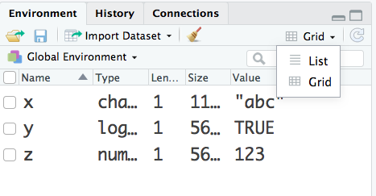

<!-- rendering
https://www.rdocumentation.org/packages/rmarkdown/versions/1.3/topics/ioslides_presentation
   -->

```{r opts,echo=FALSE}
library(knitr)
opts_chunk$set(results="hide")   ## because we want to discuss the pieces
```

<!-- BMB: not sure what this stuff is for?  Was it hidden in a previous version?  How is it helpful? -->
<!-- in markdown, two or more spaces at the end of a line specify a hard line break-->

# Basics

## R is a programming language

- You might not use R for programming,  but it will help if you understand roughly how it works inside
- What is a program?
    - A program is a collection of simple instructions (read, write, send, manipulate, calculate) that should be executed in a logical order
    - A program's flow is controlled by *control structures* (instructions about what instruction to do next)
<!--    - What are some examples of programs, and how do they work?  -->

## Calculation

R works as a (very fancy) calculator.

```{r arithmetic}
2+2
2439*41
259*3861
2+sqrt(92)
```

What about:

```{r precedence}
7+3*9
32/4*4
```
Figure out what the second one does, and
then explain how you would write it more clearly.

## Assigning values

R can remember numbers (and other things) and give them back to you. This is the foundation
of being able to write programs that do many things in a specified
order.

```{r assign}
x <- 23
print(x)
x + 17        ## no assignment!
print(x)
y <- x + 17
y             ## symbol by itself is shorthand for "print"
```


# Objects

----------------------------------------------------------------------

R keeps track of a variety of objects. You can see all of the objects
you've defined by typing `ls()` (short for "list": the parentheses
mean that you are calling a *function*; more on this later), or looking in the "Environment" tab in RStudio.

## Values

In addition to numbers, R has other kinds of values. The main ones we're interested in are `character`, `numeric` and `logical` (ie., `TRUE` or `FALSE`). `str()` (short for "structure") is one way to figure out what your R object is. 

```{r values}
num <- 3
str(num) 
 
char <- "Hello, class?"
str(char)
 
logic <- TRUE ## No quotes
str(logic)
```

## Rstudio view

You can also switch to the "Grid View" in the Environment tab in RStudio.



## Other types

At the simplest level, R objects are divided into *types*. Other than the ones above, we're mostly interested in *vectors*, *lists* and *functions*.

## Vectors

A vector consists of zero or more values of the same *storage mode*:

```{r vector}
words <- c("Mary", "had", "a", "little", "lamb")
# c() puts elements together into a vector
str(words)

v <- 1:5  ## 'm:n' creates a sequence from m to n
str(v)
```

## Vector math

R does math on vectors directly.

<!-- this flavor of markdown / pandoc needs an empty line before an itemized list -->

* If we add (for example) two vectors we add each pair of corresponding elements.
* If we multiply a vector by a *scalar* (a single number, in R really just a vector of length 1!) we multiply each element by the scalar.
* Arithmetic involving two vectors of different length is possible but dangerous (what happens??)

```{r vector_math}
v <- 1:5
w <- c(0, 1, 1, 2, 4)
v+w
2*w
```

<!--
## No scalars

R does not have any particular idea of individual numbers (or strings,
etc.); you represent a number as a vector of length 1.

JD calls this the Original Sin of S

-->

## Lists

A list is a bunch of things in order, not necessarily of the same type. Those things can be any R object - vectors, functions, other lists ...

```{r list}
L <- list(1:3, "Apple tree", TRUE)
str(L)
str(L[[1]]) ## L[1] picks out the first element of the list
LL <- list(L, c(2, 7, 9))
str(LL)
str(LL[1])
```

## Functions

Functions are "called" using parentheses. A function is a set of
commands that uses whatever "arguments" are inside the parentheses and
does things (including possibly "returning" a result).

What functions have we seen so far?

Example: `mean()` takes a vector argument and returns the mean.

```{r mean}
mean(c(2, 5, 11))
 
x <- 1:10
m_x <- mean(x)
print(m_x)
```

## About functions

You can learn about any built-in function by using R's help: type
`?"mean"` or `help("mean")`, or find the Help tab in RStudio.

Arguments can be passed to functions in order, or by using names. For
example, `mean` takes an optional argument `trim`.

```{r trim}
x <- (1:10)^2
mean(x)
mean(x, trim=0.1)
```

## Function syntax

`=` is a synonym for `<-` at the top level (and many people use it).
Be aware that **they are not synonyms inside a function call**: `<-`
still means assignment, but `=` is used to name an argument. `mean(x, trim <- 0.1)` **does not do what you think it does**.

## Variable names

R variable names are *case-sensitive*: e.g. `m` and `M` are
different variables. In general, you should not try to take advantage of this, because it may cause confusion.

R variable names have to start with a letter, and certain characters
(particularly space characters) are not allowed. Good naming conventions
include:

* Use mostly letters, underscores (`_`) and dots (`.`)
* Avoid potentially confusing names like `l` or `O`.
* Avoid built-in names (like `c`, `t`, `list`, or `data`) for variables.
* Make readable variable names using `camelCase`, `snake_case`, or `kebab.case`
*   Avoid `variableNamesThatAreExcessivelyLong`
*   Be consistent! [@baath_state_2012]

## Style

In addition to function naming there are lot of details (such as indentation) that make your code
easier to read. Check out the [style guide](../tips/R_style.notes.html)

# Compound objects

----------------------------------------------------------------------

R is a sophisticated system that builds complicated structures on top of
these simple objects. Hopefully we'll develop an intuition for more of
that as we go along. For now, we'll talk about
just a few structures.

<!-- 

## Matrices

In R, matrices are basically vectors that understand that they have a
shape. R knows how to do matrix multiplication on them, which is very
cool, and other kinds of linear algebra. There are many ways to make a
matrix: use `?"matrix"` to get more information.

```{r matrix}
m <- matrix(c(1, 3, 0, 1), nrow=2)
print(m)
# R arranges vectors into matrices in COLUMN-FIRST order, by default
 
# Elementwise ("vector") multiplication (or "Hadamard product")
m*m
 
# Matrix multiplication
m %*% m
```
-->

## Data frames

Data frames are lists of vectors organized into a rectangle (each column
is a vector; the columns all have to be the same length and every column
has to be homogeneous **but** every column can be a different mode:
in particular you can mix numbers, factors (see below), dates, ...).

We'll talk more about data frames when we start dealing with data.

`tibbles` are a special "tidyverse" version of data frames that act a little bit differently.

## Factors

Factors are used to describe items that can have a discrete, known set of values
(ice cream flavour, species, social class, etc.) - **categorical variables** in statistical
terms. We will also talk more about them later.

# More stuff

## Control structures

Control structures in R include:

-  loops: we will use `for`, `lapply` and `apply`, among others. `lapply` stands for **l**ist **apply**.
-   conditionals: `if` and `ifelse`. Use `ifelse` with care!

```{r control}
v <- 1:10
for (x in v) {
  print(x^2)
}
for (x in v) {
    if(x>=4) {
        print(x^2)
    }
}
```

## Control syntax

R uses `==` to test whether two objects are equal, and `!=` to test if they are not equal. (R will often
guess and warn you if you wrongly try to use `=`, but not always ...)

* Use `&` for "and", and `|` for "or" when testing vectors in parallel
* `&&` and `||` test single conditions; if you are using `if()` you should use them, but you can usually get away with sticking to `&` and `|` if you're confused.

## Syntactic principles

You may have noticed that we sometimes just type a variable's name in order to
print its value. It's better
practice to always say `print`, when that's what you want.

* Clearer, and less fragile

Similarly, you usually don't need to say `return(x)` to return a function value ... but you should. 

Clarity and explicitness are worth more than saving a few keystrokes.

## Selecting

You can select single elements from an R object using the element
operator `[[]]`, and subsets using the subset operator `[]`. If
the object has rows and columns, you can separate them with a comma.

You can also select things by name, using the syntax `v["name"]` or
`v[n]`, if `n` is a variable that contains the name. Use names instead of numbers whenever you can, because (1) your code will be easier to read (`x["temperature"]` instead of `x[21]`) and (2) your code will be more robust (e.g., if something changes so that temperature is now in position 22 rather than 21).

# Philosophical principles

---

- you can't break anything with R: experiment!
- periodically run your code from a clean R session to make sure it works from start to finish
- don't ignore warning messages
- **read** error messages (and Google them!) rather than guessing

# The tidyverse

## basic concepts

- a set of R packages: https://www.tidyverse.org/
- advantages
    - expressiveness
    - speed
	- new hotness
- disadvantages
    - incompatibilities with base R
	- instability (rapid change)
	- non-standard evaluation

## Sample data

We want to get some data. Before executing the code below:

- think about where you want to keep your stuff for this class
- set your **working directory** accordingly (`setwd()`, or in RStudio `Session / Set Working Directory / Choose Directory`)
- create a `data/` subdirectory if you want, or edit it out of the `destfile` argument below

```{r eval=FALSE}
download.file(url="https://ndownloader.figshare.com/files/2292169",
              destfile = "data/portal_data_joined.csv")
```

also [here](../data/portal_data_joined.csv)

## And now ...

We will continue with the [Data Carpentry](https://datacarpentry.org/) [lesson for R in ecology](https://datacarpentry.org/R-ecology-lesson/)


## References
